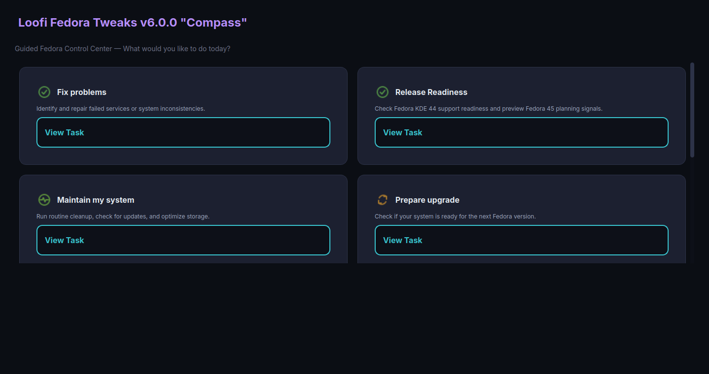

# Loofi Fedora Tweaks v5.0.0 "Aurora"

<!-- markdownlint-configure-file {"MD033": false} -->

<p align="center">
  
</p>

<p align="center">
  <strong>Fedora system management in one place</strong><br>
  GUI + CLI + daemon modes, plugin-based tabs, hardware-aware defaults, Atomic-aware behavior.
</p>

<p align="center">
  <a href="https://github.com/loofiboss-bit/loofi-fedora-tweaks/releases/tag/v5.0.0">
    
  </a>
  
  
  
  
  <a href="https://copr.fedorainfracloud.org/coprs/loofitheboss/loofi-fedora-tweaks/">
    
  </a>
</p>

---

## What Is Loofi Fedora Tweaks?

Loofi Fedora Tweaks is a desktop control center for Fedora Linux that combines day-to-day maintenance, diagnostics, tuning, networking, security, and automation in one app.

It is designed to be practical for both casual users and advanced users:

- Plugin-based UI with category-organized tabs and lazy loading.
- CLI mode for scripting and remote administration.
- Daemon mode for background automation.
- Optional headless web API mode.
- Privileged actions routed through `pkexec` prompts.
- Automatic detection of Traditional Fedora (`dnf`) and Atomic Fedora (`rpm-ostree`).

---

## What's New in v5.0.0?

`v5.0.0 "Aurora"` is the Fedora KDE 44 Experience & Compatibility release. It keeps the v4 Atlas assistant model and adds focused readiness diagnostics for the Fedora 44 KDE desktop stack.

- **Fedora KDE 44 Readiness**: Checks Fedora, Plasma, Qt, Wayland/X11, display manager, DNF5, PackageKit, repos, Atomic, NVIDIA/akmods/Secure Boot, Flatpak KDE runtimes, and TLS cert compatibility.
- **Dashboard + CLI Access**: Readiness runs from the Atlas dashboard card or `loofi-fedora-tweaks --cli fedora44-readiness`.
- **Support Bundle v3**: Adds privacy-masked Fedora KDE 44 diagnostics for support and issue reports.
- **Packaging Cleanup**: Optional Web API and daemon runtime dependencies are split from the base GUI/CLI RPM.
- **Fedora 44 Targeting**: Active release, build, and COPR guidance now targets Fedora KDE 44; Fedora 43 is best-effort compatible.

Full notes: [`docs/releases/RELEASE-NOTES-v5.0.0.md`](docs/releases/RELEASE-NOTES-v5.0.0.md)

## Current Development Cycle

Follow [`ROADMAP.md`](ROADMAP.md) for the active release branch and current implementation slice.

- Current release: **v5.0.0 "Aurora"** (see `ROADMAP.md` and `docs/releases/RELEASE-NOTES-v5.0.0.md`)
- Current stable baseline: **v5.0.0 "Aurora"** (see `CHANGELOG.md`)
- Packaged runtime/version files baseline: **5.0.0** (see `loofi-fedora-tweaks/version.py`, `pyproject.toml`, and `loofi-fedora-tweaks.spec`)

---

## What Was New in v2.11.0?

`v2.11.0 "API Migration Slice 7"` focuses on hardening network, firewall, and system service local execution paths.

## What Was New in v1.0.0?

`v1.0.0 "Foundation"` reset the version numbering and established the project baseline with all prior features consolidated under a clean semantic version.

---

## Installation

### Install from COPR (Recommended)

The package is published on [Fedora COPR](https://copr.fedorainfracloud.org/coprs/loofitheboss/loofi-fedora-tweaks/). This gives you automatic updates via `dnf`.

```bash
sudo dnf copr enable loofitheboss/loofi-fedora-tweaks
sudo dnf install loofi-fedora-tweaks
```

To uninstall:

```bash
sudo dnf remove loofi-fedora-tweaks
sudo dnf copr remove loofitheboss/loofi-fedora-tweaks
```

### Install from a Release RPM

Download the `.noarch.rpm` from the [Releases](https://github.com/loofiboss-bit/loofi-fedora-tweaks/releases) page:

```bash
sudo dnf install ./loofi-fedora-tweaks-*.noarch.rpm
```

### Run from Source

```bash
git clone https://github.com/loofiboss-bit/loofi-fedora-tweaks.git
cd loofi-fedora-tweaks
python3 -m venv .venv
source .venv/bin/activate
pip install -r requirements.txt
PYTHONPATH=loofi-fedora-tweaks python3 loofi-fedora-tweaks/main.py
```

---

## Run Modes

| Mode    | Command                               | Use case                    |
| ------- | ------------------------------------- | --------------------------- |
| GUI     | `loofi-fedora-tweaks`                 | Daily desktop usage         |
| CLI     | `loofi-fedora-tweaks --cli <command>` | Scripting and quick actions |
| Daemon  | `loofi-fedora-tweaks --daemon`        | Background scheduled tasks  |
| Web API | `loofi-fedora-tweaks --web`           | Headless/remote integration |

### Web API network configuration

The Web API reads these optional environment variables:

- `LOOFI_API_HOST` (default: `127.0.0.1`)
- `LOOFI_API_PORT` (default: `8000`)
- `LOOFI_CORS_ORIGINS` (comma-separated origin allowlist)

Example for LAN host `192.168.1.3`:

```bash
export LOOFI_API_HOST=0.0.0.0
export LOOFI_API_PORT=18001
export LOOFI_CORS_ORIGINS="http://192.168.1.3:18001"
loofi-fedora-tweaks --web
```

Optional shell alias for convenience:

```bash
alias loofi='loofi-fedora-tweaks --cli'
```

---

## Icon System

- Semantic icon IDs are used across sidebar categories, tabs, dashboard quick actions, and command surfaces.
- Runtime icon resolution/tinting is handled by `loofi-fedora-tweaks/ui/icon_pack.py`.
- Asset locations (kept mirrored for dev/runtime packaging):
  - `assets/icons/`
  - `loofi-fedora-tweaks/assets/icons/`
- Pack structure:
  - `svg/` source icons
  - `png/16`, `png/20`, `png/24`, `png/32` raster fallbacks
  - `icon-map.json` semantic id map

---

## Built-In Tabs

| Category    | Tabs                                                          |
| ----------- | ------------------------------------------------------------- |
| System      | Home, System Info, System Monitor, Community                  |
| Packages    | Software, Maintenance, Snapshots                              |
| Hardware    | Hardware, Performance, Storage, Gaming                        |
| Network     | Network, Loofi Link                                           |
| Security    | Security & Privacy, Backup                                    |
| Appearance  | Desktop, Profiles, Extensions, Settings                       |
| Tools       | Development, AI Lab, Virtualization                           |
| Maintenance | Agents, Automation, Diagnostics, Health, Logs, State Teleport |

---

## Screenshots

Current UI screenshots are maintained in:

- [`docs/images/user-guide/README.md`](docs/images/user-guide/README.md)

Preview gallery:




---

## CLI Quick Examples

All commands below assume either:

- `loofi-fedora-tweaks --cli ...`, or
- alias `loofi='loofi-fedora-tweaks --cli'`

### System and Health

```bash
loofi info
loofi health
loofi doctor
loofi hardware
loofi support-bundle
```

### Maintenance and Tuning

```bash
loofi cleanup all
loofi cleanup journal --days 7
loofi tweak power --profile balanced
loofi tuner analyze
loofi tuner apply
```

### Logs, Services, Packages

```bash
loofi logs errors --since "2h ago"
loofi service list --filter failed
loofi service restart sshd
loofi package search --query firefox --source all
```

### Security, Network, Storage

```bash
loofi security-audit
loofi network dns --provider cloudflare
loofi storage usage
loofi firewall ports
```

### Plugins and Marketplace

```bash
loofi plugins list
loofi plugin-marketplace search --query monitor
loofi plugin-marketplace info cool-plugin
loofi plugin-marketplace install cool-plugin --accept-permissions
loofi plugin-marketplace reviews cool-plugin --limit 10
loofi plugin-marketplace rating cool-plugin
```

### JSON Output for Automation

```bash
loofi --json info
loofi --json health
loofi --json package search --query vim
```

---

## Requirements

- Fedora KDE 44 supported target
- Fedora 43 best-effort compatibility
- Python 3.12+
- PyQt6
- polkit (`pkexec`)

Optional features may require extra packages (for example: virtualization tools, Ollama, firewalld, avahi).

---

## Documentation

- Beginner quick guide: [`docs/BEGINNER_QUICK_GUIDE.md`](docs/BEGINNER_QUICK_GUIDE.md)
- User guide: [`docs/USER_GUIDE.md`](docs/USER_GUIDE.md)
- Advanced admin guide: [`docs/ADVANCED_ADMIN_GUIDE.md`](docs/ADVANCED_ADMIN_GUIDE.md)
- Troubleshooting: [`docs/TROUBLESHOOTING.md`](docs/TROUBLESHOOTING.md)
- Contributing: [`docs/CONTRIBUTING.md`](docs/CONTRIBUTING.md)
- Plugin SDK: [`docs/PLUGIN_SDK.md`](docs/PLUGIN_SDK.md)
- Changelog: [`CHANGELOG.md`](CHANGELOG.md)
- Documentation index: [`docs/README.md`](docs/README.md)

---

## Development Quick Start

Run tests:

```bash
PYTHONPATH=loofi-fedora-tweaks python -m pytest tests/ -v
```

### Windows developers: run tests in Linux (Docker-first primary path)

Some tests rely on Linux-specific APIs (`/proc`, `statvfs`, `getloadavg`, `system tools`) and can fail on native Windows runs.
Use the Linux-backed runner instead:

```bash
# Auto: try Docker first, fallback to WSL
just test-linux

# Force Docker backend
just test-linux-docker

# Force WSL backend
just test-linux-wsl
```

VS Code tasks are also available:

- `Dev: Run Tests (Linux Auto: Docker→WSL)`
- `Dev: Run Tests (Linux WSL)`
- `Dev: Run Tests (Linux venv Docker, Primary)`

Lint:

```bash
flake8 loofi-fedora-tweaks/ --max-line-length=150 --ignore=E501,W503,E402,E722,E203
```

Type check:

```bash
mypy loofi-fedora-tweaks/ --ignore-missing-imports --no-error-summary --warn-return-any
```

Security scan:

```bash
bandit -r loofi-fedora-tweaks/ -ll -ii --skip B103,B104,B108,B310,B404,B603,B602
```

Build RPM:

```bash
bash scripts/build_rpm.sh
```

---

## CI/CD Pipeline

Every push to `master` and every pull request runs through two pipelines:

| Pipeline | File | Purpose |
| --- | --- | --- |
| CI | `.github/workflows/ci.yml` | Lint, typecheck, test, security, and Fedora review gate |
| Auto Release | `.github/workflows/auto-release.yml` | Validate, gate checks, build, tag, GitHub release, then integrated COPR submit |
| COPR Publish | `.github/workflows/copr-publish.yml` | Standalone/manual COPR publishing workflow |

### Auto Release Flow

```text
push to master
  → validate (version alignment, packaging scripts)
  → adapter_drift, lint, typecheck, test, security, docs_gate, fedora_review (parallel)
  → build (RPM in Fedora 44 container)
  → auto_tag (creates vX.Y.Z tag if missing)
  → release (publishes GitHub Release with RPM/Flatpak/sdist artifacts)
  → copr_publish (builds SRPM and submits to Fedora COPR)
```

`fedora_review` runs `python3 scripts/check_fedora_review.py`, which requires `fedora-review`
and validates lightweight health probes (`fedora-review -V` and `fedora-review -d`).

The pipeline automatically tags and publishes releases when code lands on `master` with a new version in `version.py`. No manual tagging required.

### Manual Release

Use **workflow_dispatch** with the version number for manual control. Set `dry_run: true` to validate without publishing.

---

## License

MIT License.
