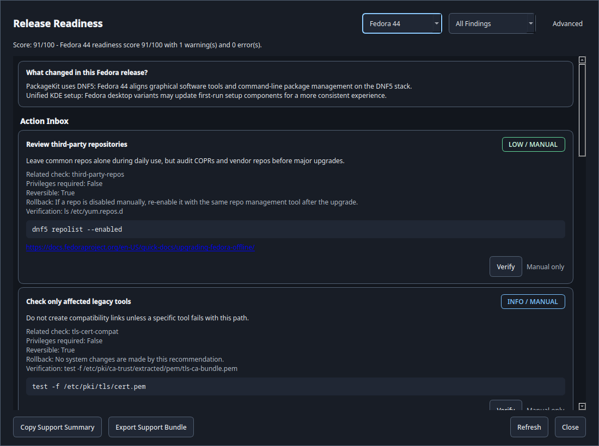
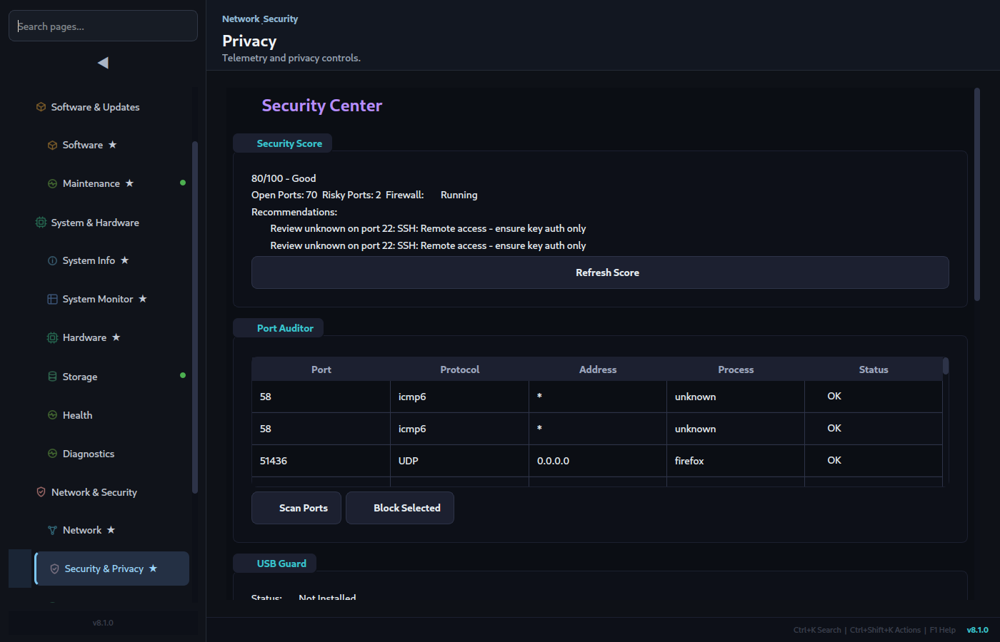
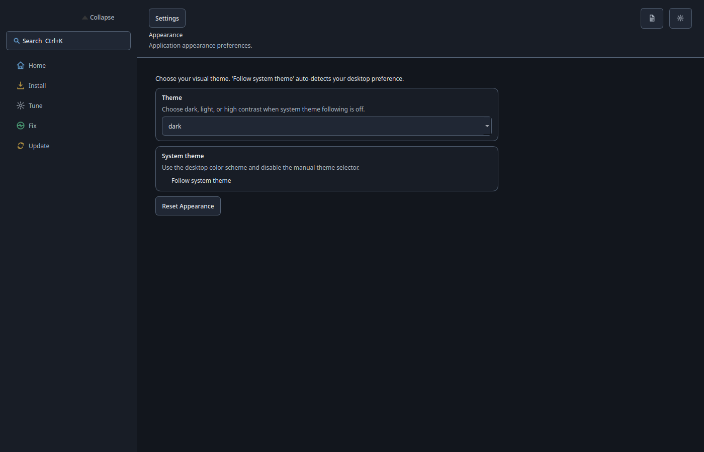

# Loofi Fedora Tweaks — Beginner Quick Guide

> Version 12.0.0 "Lighthouse" — My Fedora Today, Action Center, and Safe Guided Actions

Use this guide for a safe first run in under 10 minutes.

---

## 1) Install and Launch

```bash
pkexec dnf copr enable loofitheboss/loofi-fedora-tweaks
pkexec dnf install loofi-fedora-tweaks
loofi-fedora-tweaks
```

Optional CLI alias:

```bash
alias loofi='loofi-fedora-tweaks --cli'
```

---

## 2) Learn the UI in 30 Seconds

- Sidebar = five focused areas plus search and favorites
- Main panel = active tools with larger sections and clearer cards
- Footer = compact status and shortcuts

Useful shortcuts:

- `Ctrl+K` command palette
- `Ctrl+Shift+K` quick actions
- `F1` help


---

## 3) First 5 Actions

### Action 1 — Plan Updates With Upgrade Assistant

Open:

- **Home**
- **Upgrade Assistant**

Review Fedora 44 readiness, Fedora 45 preview notes, the next safe action, and support export.


Then open **Release Readiness** when you want the detailed score, filters, and Action Inbox.



CLI equivalent:

```bash
loofi readiness --target 44
loofi readiness plan --target 45-preview
loofi action-center list --target 44
```

### Action 2 — Check Health

Open:

- **System & Hardware → System Monitor**

Look for high CPU/RAM/process spikes.


### Action 3 — Run Updates

Open **Software & Updates → Maintenance → Updates** and run **Update All**.

Notes:

- Admin prompt uses `pkexec`
- Atomic systems use `rpm-ostree` behavior automatically


### Action 4 — Clean Up

Open **Software & Updates → Maintenance → Cleanup** and run:

- cache clean
- journal vacuum
- SSD trim (if applicable)

### Action 5 — Security Pass

Open **Network & Security → Security & Privacy**:

- refresh score
- verify firewall status
- run port scan if needed



### Action 6 — Save Preferences

Open **Desktop & Settings → Settings** and configure:

- update checks on startup
- safety confirmations enabled



---

## 4) Weekly Routine

1. Run updates
2. Run cleanup
3. Refresh security score
4. Quick check System Monitor

---

## 5) Useful CLI Commands

```bash
loofi info
loofi health
loofi fedora44-readiness
loofi readiness actions --target 44
loofi doctor
loofi cleanup all
loofi security-audit
```

---

## 6) Next Docs

- Full user guide: `docs/USER_GUIDE.md`
- Fedora KDE 44 readiness: `docs/FEDORA_KDE_44_READINESS.md`
- Advanced operations: `docs/ADVANCED_ADMIN_GUIDE.md`
- Troubleshooting: `docs/TROUBLESHOOTING.md`
