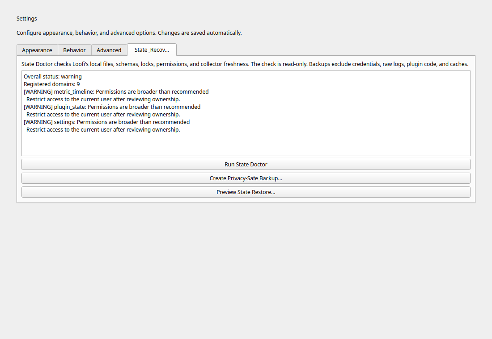

# State Integrity and Recovery

Loofi Fedora Tweaks v23.0.2 "Compass" keeps application-owned state under
standard XDG config, data, cache, and runtime directories. Fedora 44 is the
supported baseline; Fedora 45 remains preview/advisory.

## Beginner: check and back up

Open **Settings → State & Recovery** and select **Run State Doctor**. The doctor is read-only: it checks registered paths, permissions, JSON/JSONL readability, SQLite integrity, stale locks, and recovery availability without changing files.




The same contracts are available in the CLI:

```bash
loofi-fedora-tweaks --cli --json state doctor
loofi-fedora-tweaks --cli state backup --output loofi-state.zip
loofi-fedora-tweaks --cli --json state restore plan loofi-state.zip
```

Review restore plans in **Settings → State & Recovery**. Applying a restore
accepts only the ID produced for the same validated archive and creates a
rollback archive before replacing any domain.

## Advanced: schemas, locks, and recovery

- Schema IDs are independent of application versions. Migrations advance exactly one version, are idempotent, retain old input, and record completion after verified readback.
- Unsupported future schemas are read-only and never overwritten.
- JSON/text state writes use a same-directory temporary file, `fsync`, atomic replace, directory `fsync`, private permissions, readback verification, and a bounded `.lkg` copy.
- Concurrent GUI, CLI, and daemon access uses advisory locks with bounded timeouts and a typed busy result.
- Numeric health metrics remain SQLite data. Structured health snapshots remain JSON. `ObservabilityService` reports both without conflating their schemas.
- The daemon collector is read-only. It never upgrades, cleans, resets, restores, flashes firmware, or restarts services.

## Archive threat model

Default backups exclude credentials, authentication state, raw logs, plugin code, and caches. Archives are rejected for path traversal, duplicate paths/domains, oversized entries, unsupported schemas, missing content, or SHA-256 mismatch.

For corruption, disk-full, permissions, stale locks, and migration failures, preserve the original evidence and follow the domain-specific next step printed by State Doctor. Never delete corrupt input before a recovery copy exists.

## Traditional and Atomic capability matrix

The typed runtime registry lives in `core.platform.capabilities`. Unsupported actions remain visible with a reason and safe alternative.

| Action family | Traditional | Atomic | Atomic guidance |
| --- | --- | --- | --- |
| Package install/remove/update | Supported | Supported | Use rpm-ostree layering/staged deployments or Flatpak |
| Autoremove | Supported | Unsupported | The base image is managed as a deployment |
| Cache cleanup | Supported | Read-only | Inspect usage; avoid immutable-base mutation |
| Service/firewall/firmware | Supported | Supported | Same explicit confirmation and Polkit boundary |
| State restore | Supported | Supported | User state is independent of the immutable base |
