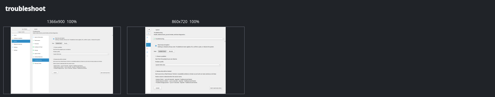

# Loofi Fedora Tweaks — User Guide

> Version 23.1.0 "Compass"

This guide covers daily use in GUI and CLI mode. For a short first run, see
`docs/BEGINNER_QUICK_GUIDE.md`. For operational detail, see
`docs/ADVANCED_ADMIN_GUIDE.md`.

---

## 1) What Loofi Does

Loofi Fedora Tweaks is a Fedora control center with four entry modes:

- GUI: `loofi-fedora-tweaks`
- CLI: `loofi-fedora-tweaks --cli ...`
- daemon: `loofi-fedora-tweaks --daemon`
- optional Web API: `loofi-fedora-tweaks --web`

The GUI groups stable route IDs into six destinations. Built-in pages
are registered from data-only specifications and their UI modules are imported
only when needed. Privileged operations use `pkexec`, never `sudo`, and preserve
Traditional Fedora DNF and Atomic Fedora rpm-ostree behavior.

---

## 2) Install and Launch

Install from [Fedora COPR](https://copr.fedorainfracloud.org/coprs/loofitheboss/loofi-fedora-tweaks/):

```bash
pkexec dnf copr enable loofitheboss/loofi-fedora-tweaks
pkexec dnf install loofi-fedora-tweaks
```

Optional runtime packages:

```bash
pkexec dnf install loofi-fedora-tweaks-api
pkexec dnf install loofi-fedora-tweaks-daemon
```

Or install a downloaded release RPM:

```bash
pkexec dnf install ./loofi-fedora-tweaks-*.noarch.rpm
```

Launch the GUI:

```bash
loofi-fedora-tweaks
```

Optional CLI alias:

```bash
alias loofi='loofi-fedora-tweaks --cli'
```

---

## 3) Navigation and Search

The application presents these six destinations:

| Destination | Everyday purpose |
| --- | --- |
| **Home** | Prioritized status, recommendations, and safe links |
| **Software & Updates** | Applications, repositories, updates, cleanup, upgrades, and Action Center |
| **System** | System information, performance, processes, hardware, storage, diagnostics, and recovery points |
| **Network & Security** | Connections, DNS, privacy, firewall, exposure, and backups |
| **Desktop** | Appearance, windows, and displays |
| **Settings** | Appearance, behavior, Specialist Tools status, Repair Loofi, and About |

**Specialist Tools** keeps grouped, searchable routes such as Performance
Tuning, Gaming, Development, Local Profiles, Loofi Link, AI Lab, Agents,
Automation, State Teleport, and Virtualization discoverable. Component and
host policy may mark an individual route unavailable; visibility never weakens
its safety or confirmation requirements.

Primary shortcuts:

- `Ctrl+K`: global route, setting, and safe-action search.
- `Ctrl+Shift+K`: the same search model filtered to actions.
- `Ctrl+Tab` / `Ctrl+Shift+Tab`: next or previous destination.
- `F1`: shortcut help.
- `Ctrl+Q`: quit.

Global search applies `NavigationPolicy` before showing or activating a result.
It cannot bypass unavailable components, Fedora variant constraints, required
capabilities, or Action Center safety. An Action Center
result may navigate and preselect only; it cannot plan, run, or verify.

---

## 4) Five Core Workflows

Home keeps five direct task links visible: **Check for updates**, **Install an
app**, **Troubleshoot a problem**, **Free space**, and **Review planned
changes**. Home shows one primary recommendation at a time. Before the first
System Check it shows one **Not checked yet** state; a failed read is reported
separately as **Status check failed**.

### Update the system

Open **Software & Updates → Updates**, review the available updates, and confirm
the plan details in Action Center before applying it separately. The page shows
the selected source, restart expectation, and required verification before the
handoff. Traditional Fedora updates the current installation. Atomic Fedora
creates a new deployment and verifies it after the required restart.

### Install an application

Open **Software & Updates → Applications**, choose an application, and create a
review plan. Each row identifies the package, source, restart handling, and
installation-state verification. Search and source/status filters remain
available. Plan creation never installs as a side effect.

### Diagnose a slow system

Open **System → Performance** and select **Analyze Slow System**. Loofi takes a
bounded, read-only snapshot of CPU, memory, storage, I/O wait, processes, failed
services, and recurring health signals. It explains the strongest signal before
offering a safe next route.

### Free disk space

Open **Software & Updates → Cleanup** and run the reclaim analysis. Package
cache, journal retention, and filesystem trim remain separate categories with
their own estimate, risk, and availability guidance. Only the low-risk package
cache can be a safe default; journal retention, unused packages, trim, and
repair choices stay under closed advanced controls. Every cleanup creates an
Action Center plan. Run the analysis again afterward to verify reclaimed space
and review any partial result. Atomic Fedora keeps DNF cache cleanup
manual-only.

### Protect or recover the system

Open **System → Recovery Points** to inspect or create Timeshift, Snapper, or
Btrfs snapshots. Open **Network & Security → Backups** for guided backup and
restore. Repair Loofi remains available from Settings and reuses the v14 State
Doctor and archive services.

### Check maintenance outcomes

Use **Check now** on Home to start the explicit read-only System Check. Review
current findings and before/after history under **System → System Check**. A
mapped finding can open one exact Action Center action for review; it never
supplies a command or confirms execution.

After a linked action is independently verified, Action Center offers
**Check again**. Verification and resolution are separate: verifier success
does not remove a finding, and a reboot-required run remains pending. Only a
later compatible check can classify the original finding as resolved,
unchanged, worsened, or not comparable.

### Troubleshoot a problem

Open **System → Troubleshooting** and start from one of eight plain-language
symptoms: no internet, sound, Bluetooth, failed updates, an app that will not
start, a slow system, full storage, or something else. Collection starts only
after **Start read-only check** is activated. The default result explains what
was checked, what was found, confidence or missing checks, and one safe next
step. Source, freshness, timing, and schema detail stay in the collapsed
technical-details section. A next action says whether it opens Action Center
to create a plan; nothing runs automatically.

After a relevant change, explicitly rerun the compatible profile. The
follow-up compares sessions only when profile, Fedora variant, ordering, and
required evidence remain compatible. Troubleshooting `resolved` and Action
Center `verified` remain separate facts.



---

## 5) Action Center Safety

**Software & Updates → Action Center** is the only plan/run/verify GUI.

The primary work list is grouped by **Needs review**, **Ready**, **Running**,
**Waiting for restart**, **Completed**, and **Failed**. Select a change to see
its intended outcome, affected components, privilege and restart requirements,
verification, and recovery guidance. Definition IDs, command previews, and
source metadata remain in collapsed details and advanced review tools.

- The catalog contains 74 first-party definitions. Each definition declares its
  operation class, Fedora variants, reboot policy, affected resources,
  parameters, preflight, confirmation, verification, and recovery policy.
- Unsupported host operations produce non-executable `manual_only` plans.
- Plans expire and are re-preflighted before execution.
- Execution requires explicit confirmation and, when applicable, explicit
  acknowledgement that rollback is unavailable.
- A cross-process lease permits only one mutation at a time.
- Verification is separate; command exit code zero is not sufficient.
- Interrupted runs remain recorded and never resume, retry, or roll back
  automatically.
- Home, global search, deep links, CLI listing, API status, and recommendations
  do not silently execute actions.
- The loopback API may create a plan from one exact catalog definition, but
  cannot confirm or apply it.
- Daemon, scheduler, automation, and agent paths may create plans but cannot
  confirm or execute them.

Read-only inspection:

```bash
loofi action-center list --target 44
loofi action-center history --limit 10
loofi action-center recommendations --target 44
```

See `docs/VERIFIED_MAINTENANCE.md` for the complete lifecycle.

---

## 6) Built-in Providers and Local Profiles

The base RPM ships the reviewed built-in source tree. Core startup does not
import specialist UI modules, and specialist pages load after route activation.
External Python plugin discovery and execution are retired.

If a specialist component is missing or incomplete, policy marks its routes
unavailable while the six Standard destinations, Home, the five core workflows,
and Action Center remain usable. The API and daemon keep their existing
subpackage boundaries and exact base-package dependency.

**Specialist Tools → Local Profiles** accepts explicit local JSON files with a closed,
data-only schema. Imported content is validated before it can become a
reviewable plan. The same area inventories legacy extension directories for
export but never imports or deletes their Python code.

The hidden `plugin-marketplace` CLI compatibility command always returns a
machine-readable `feature_retired` response. Use built-in features or local
profiles instead.

---

## 7) CLI by Task

System and diagnostics:

```bash
loofi info
loofi health check
loofi health findings
loofi health comparison
loofi health history --limit 10
loofi troubleshoot profiles
loofi troubleshoot run system_slow
loofi troubleshoot latest
loofi troubleshoot show SESSION_ID
loofi troubleshoot compare SESSION_ID FOLLOWUP_ID
loofi troubleshoot export SESSION_ID
loofi readiness --target 44
loofi readiness --target 44 --advanced
loofi readiness actions --target 44
loofi readiness action-preview readiness-repo-cache-clean --target 44
loofi doctor
loofi support-bundle
```

Reviewed plan creation:

```bash
loofi action-center plan dnf-clean-all
loofi action-center show PLAN_ID
```

Plan creation never applies a change. Host-changing legacy commands remain
parse-compatible where practical, but return a review plan or explicit manual
guidance instead of executing.

Services, packages, and logs:

```bash
loofi service list --filter failed
loofi package search --query firefox --source all
loofi logs errors --since "2h ago"
```

Security, network, and storage:

```bash
loofi security-audit
loofi firewall status
loofi storage usage
```

Specialist CLI contracts remain available independently of GUI grouping:

```bash
loofi agent list
loofi vm list
loofi vfio check
loofi mesh discover
loofi teleport capture --path ~/workspace --target laptop
```

Machine-readable output:

```bash
loofi --json info
loofi --json health findings
loofi --json health comparison
loofi --json readiness --target 44
```

---

## 8) Data Locations

- `~/.config/loofi-fedora-tweaks/settings.json`
- `~/.config/loofi-fedora-tweaks/profile.json`
- `~/.config/loofi-fedora-tweaks/first_run_complete`
- `~/.local/share/loofi-fedora-tweaks/startup.log`

Compass preserves settings, favorites, stable route IDs, observability data,
and readable Action Center v1-v3 state. Writable Action Center plans and runs
migrate atomically to schema v4; unknown future schemas remain read-only. The
optional troubleshooting store retains at most 20 explicitly collected
terminal sessions and also preserves unknown future schemas read-only.

---

## 9) Troubleshooting and Support

Start with the guided GUI or explicit CLI collection:

```bash
loofi troubleshoot profiles
loofi troubleshoot run system_slow
loofi troubleshoot latest
loofi doctor
loofi info
loofi support-bundle
```

Use `loofi troubleshoot export SESSION_ID` to create a Support Bundle v13 case
from one selected retained session. Export never starts collection. Then review
`docs/TROUBLESHOOTING.md`. When opening an issue, include the Fedora variant,
exact route or command, full error output, reproduction steps, and
support-bundle path.

Issue tracker: <https://github.com/loofiboss-bit/loofi-fedora-tweaks/issues>

---

## 10) Release Scope

Fedora 44 is the supported release target. Fedora 45 remains preview-only.
Version 23.1.0 is the current release.
The historical Architecture Hardening tag object is preserved under
`legacy-v23.0.0-architecture-hardening`. Its release evidence records exact
commit, artifact, signature, checksum, SBOM/provenance, CI, COPR, Fedora 44
installation, and public-documentation readback.
