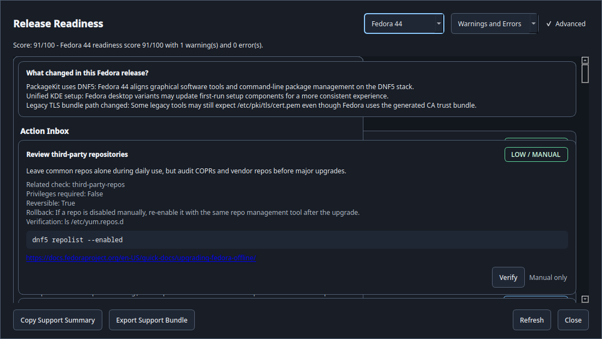

# Loofi Fedora Tweaks — User Guide

> Version 11.0.0 "Harbor" — Unified Action Center and Daily Maintenance Trust

This guide covers daily use of Loofi Fedora Tweaks in GUI and CLI mode.

For quick onboarding use `docs/BEGINNER_QUICK_GUIDE.md`.
For admin workflows use `docs/ADVANCED_ADMIN_GUIDE.md`.

---

## 1) What Loofi Does

Loofi Fedora Tweaks is a Fedora control center with three entry modes:

- GUI (`loofi-fedora-tweaks`)
- CLI (`loofi-fedora-tweaks --cli ...`)
- Daemon (`loofi-fedora-tweaks --daemon`)

Core behavior:

- Focused navigation areas backed by stable plugin and route IDs
- Plugin-based pages loaded via registry and lazy widgets
- Privileged actions executed with `pkexec` (never `sudo`)
- Automatic Fedora mode detection (`dnf` vs `rpm-ostree`)
- Safety confirmations for dangerous operations
- Fedora KDE 44 readiness diagnostics with beginner, advanced, and guided action views

---

## 2) Install and Launch

Install from [Fedora COPR](https://copr.fedorainfracloud.org/coprs/loofitheboss/loofi-fedora-tweaks/):

```bash
pkexec dnf copr enable loofitheboss/loofi-fedora-tweaks
pkexec dnf install loofi-fedora-tweaks
```

Optional runtime packages:

```bash
pkexec dnf install loofi-fedora-tweaks-api
pkexec dnf install loofi-fedora-tweaks-daemon
```

Or download the RPM from the [Releases](https://github.com/loofiboss-bit/loofi-fedora-tweaks/releases) page:

```bash
pkexec dnf install ./loofi-fedora-tweaks-*.noarch.rpm
```

Launch:

```bash
loofi-fedora-tweaks
```

Optional CLI alias:

```bash
alias loofi='loofi-fedora-tweaks --cli'
```

---

## 3) UI Layout and Navigation

Main areas:

- Sidebar: five focused areas by default, with search and favorites
- Header area: current page title, route context, and actions
- Main pane: active tools with roomier sections and adaptive cards
- Footer: compact app state and shortcuts

Primary shortcuts:

- `Ctrl+K` command palette
- `Ctrl+Shift+K` quick actions
- `Ctrl+Tab` / `Ctrl+Shift+Tab` next/previous tab
- `F1` shortcuts help
- `Ctrl+Q` quit

Default sidebar areas:

- Home
- Software & Updates
- System & Hardware
- Network & Security
- Desktop & Settings

Advanced and specialized pages are not removed. AI Lab, Agents, Automation, Logs, Community, Teleport, Virtualization, Gaming, Performance, Profiles, Extensions, Snapshots, and Loofi Link remain available from search, favorites, command palette, direct routes, and Advanced mode.


---

## 4) Recommended Workflows

### Daily (2–3 minutes)

1. Check **Home → Upgrade Assistant** or **Home → Release Readiness** after install or system upgrades.
2. Check **System & Hardware → System Monitor** for abnormal CPU/RAM/process usage.
3. Check **Network & Security → Security & Privacy** if score dropped or alerts appear.


### Weekly Maintenance

1. Run updates from **Software & Updates → Maintenance → Updates**.
2. Run cleanup actions from **Software & Updates → Maintenance → Cleanup**.
3. Validate security score and firewall status.
4. Refresh snapshots before risky changes from search, favorites, or Advanced mode.


### Before Risky Changes

1. Create a snapshot.
2. Export profile(s).
3. Create support bundle if troubleshooting baseline is needed:

```bash
loofi support-bundle
```

---

## 5) Areas and Routes

## Home

- **Home**: health score, quick status, fast navigation
- **Release Readiness**: Home card for Fedora KDE 44 support checks and safe guided action planning

## Software & Updates

- **Software**: applications, repositories, Flatpak, RPM Fusion, Flathub, and COPR sources
- **Maintenance**: updates, cleanup, smart updates, and Atomic overlays
- **Snapshots**: create/delete/refresh snapshot timeline, visible in Advanced mode or by search/favorite
- **Virtualization**: VM operations, passthrough checks, and disposable flows, visible in Advanced mode or by search/favorite

## System & Hardware

- **System Info**: OS/kernel/hardware/system metadata
- **System Monitor**: performance and process analysis
- **Hardware**: power/governor/fan/audio/Bluetooth helper controls
- **Storage**: disk usage, SMART, TRIM, filesystem checks
- **Health**: historical health timeline/trends
- **Diagnostics**: service/system checks and support actions
- **Performance** and **Gaming**: advanced tuning shortcuts, visible in Advanced mode or by search/favorite

## Network & Security

- **Network**: connections, DNS, privacy, monitoring
- **Security & Privacy**: score, firewall, telemetry, hardening actions
- **Backup**: guided backup and restore workflows
- **Loofi Link**: local peer discovery, clipboard, file drop, visible in Advanced mode or by search/favorite


## Desktop & Settings

- **Desktop**: desktop/theming controls
- **Settings**: appearance, behavior, advanced options
- **Profiles**: save/apply/import/export profile states, visible in Advanced mode or by search/favorite
- **Extensions**: desktop extension compatibility, visible in Advanced mode or by search/favorite
- **Development Tools**: containers and developer setup, visible in Intermediate/Advanced mode or by search/favorite


## More and Advanced

- **AI Lab**: models, voice, and knowledge indexing
- **Agents**: local agent dashboard and controls
- **Automation**: scheduler and replicator workflows
- **Community**: presets and marketplace actions
- **Logs**: filtered log inspection and export tools
- **State Teleport**: capture/restore workspace state packages


---

## 6) CLI by Task

System and diagnostics:

```bash
loofi info
loofi health
loofi readiness --target 44
loofi readiness --target 44 --advanced
loofi readiness actions --target 44
loofi readiness action-preview readiness-repo-cache-clean --target 44
loofi doctor
loofi support-bundle
```

Advanced readiness details show the read-only probe command and manual recommendation metadata. Action Inbox commands show reviewable action candidates and require confirmation before any supported mutating action can run:



Maintenance:

```bash
loofi cleanup all
loofi cleanup journal --days 7
loofi tuner analyze
loofi tuner apply
```

Services/packages/logs:

```bash
loofi service list --filter failed
loofi service restart sshd
loofi package search --query firefox --source all
loofi logs errors --since "2h ago"
```

Security/network/storage:

```bash
loofi security-audit
loofi firewall status
loofi network dns --provider cloudflare
loofi storage usage
```

Automation and advanced:

```bash
loofi agent list
loofi vm list
loofi vfio check
loofi mesh discover
loofi teleport capture --path ~/workspace --target laptop
```

Machine-readable output:

```bash
loofi --json info
loofi --json health
loofi --json readiness --target 44
```

---

## 7) Data Locations

- `~/.config/loofi-fedora-tweaks/settings.json`
- `~/.config/loofi-fedora-tweaks/profile.json`
- `~/.config/loofi-fedora-tweaks/first_run_complete`
- `~/.local/share/loofi-fedora-tweaks/startup.log`

---

## 8) Troubleshooting and Support

First-line diagnostics:

```bash
loofi doctor
loofi info
loofi support-bundle
```

Then review `docs/TROUBLESHOOTING.md`.

If opening an issue, include:

1. Fedora version and desktop environment
2. Exact tab/action or command
3. Full error output
4. Reproduction steps
5. Support bundle path

Issue tracker: <https://github.com/loofiboss-bit/loofi-fedora-tweaks/issues>

---

## 9) Screenshot Catalog

All current user-guide screenshots are tracked in:

- `docs/images/user-guide/README.md`
