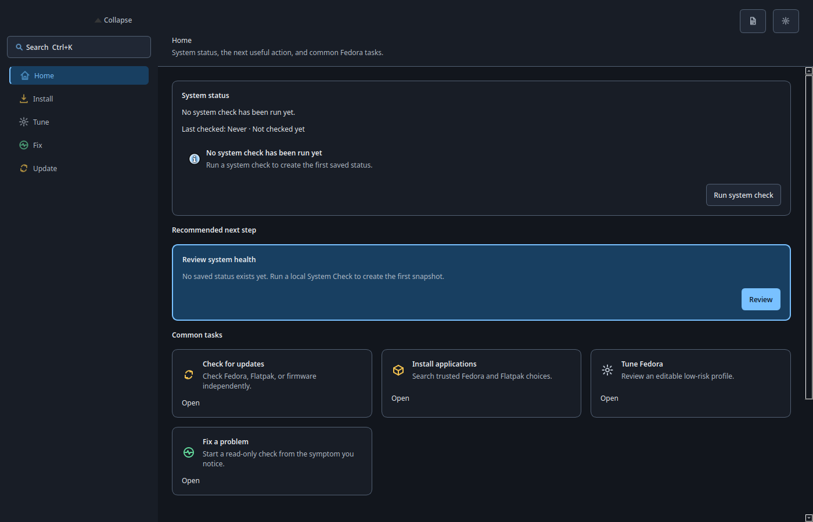
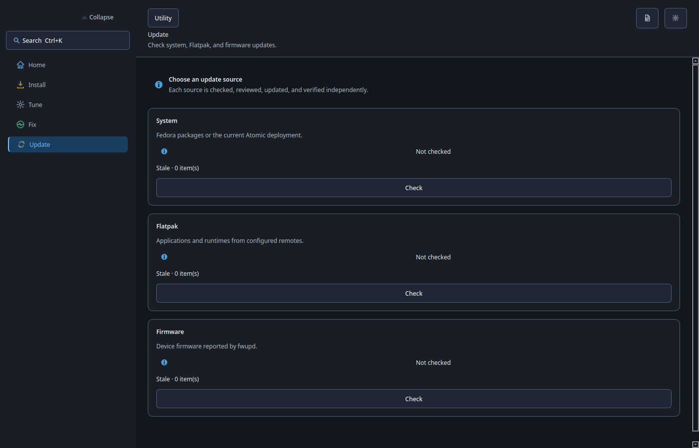
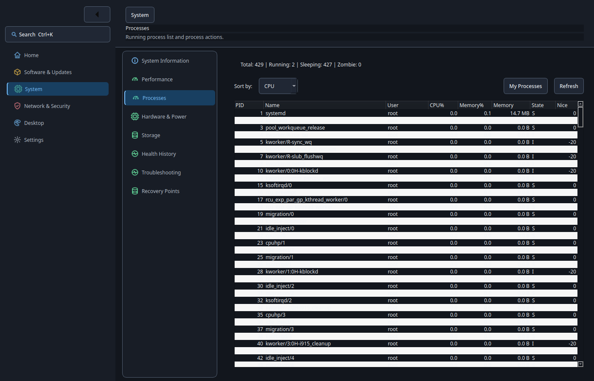

# Loofi Fedora Tweaks — User Guide

> Version 17.0.0 "Assurance" — verified core workflows and preserved responsive navigation

This guide covers daily use in GUI and CLI mode. For a short first run, see
`docs/BEGINNER_QUICK_GUIDE.md`. For operational detail, see
`docs/ADVANCED_ADMIN_GUIDE.md`.

---

## 1) What Loofi Does

Loofi Fedora Tweaks is a Fedora control center with four entry modes:

- GUI: `loofi-fedora-tweaks`
- CLI: `loofi-fedora-tweaks --cli ...`
- daemon: `loofi-fedora-tweaks --daemon`
- optional Web API: `loofi-fedora-tweaks --web`

The GUI groups stable route IDs into six Standard destinations. Built-in pages
are registered from data-only specifications and their UI modules are imported
only when needed. Privileged operations use `pkexec`, never `sudo`, and preserve
Traditional Fedora DNF and Atomic Fedora rpm-ostree behavior.

---

## 2) Install and Launch

Install from [Fedora COPR](https://copr.fedorainfracloud.org/coprs/loofitheboss/loofi-fedora-tweaks/):

```bash
pkexec dnf copr enable loofitheboss/loofi-fedora-tweaks
pkexec dnf install loofi-fedora-tweaks
```

Optional runtime packages:

```bash
pkexec dnf install loofi-fedora-tweaks-api
pkexec dnf install loofi-fedora-tweaks-daemon
```

Or install a downloaded release RPM:

```bash
pkexec dnf install ./loofi-fedora-tweaks-*.noarch.rpm
```

Launch the GUI:

```bash
loofi-fedora-tweaks
```

Optional CLI alias:

```bash
alias loofi='loofi-fedora-tweaks --cli'
```

---

## 3) Navigation and Search

Standard mode always presents these six destinations:

| Destination | Everyday purpose |
| --- | --- |
| **Home** | Prioritized status, recommendations, and safe links |
| **Software & Updates** | Applications, repositories, updates, cleanup, upgrades, and Action Center |
| **System** | System information, performance, processes, hardware, storage, diagnostics, and recovery points |
| **Network & Security** | Connections, DNS, privacy, firewall, exposure, and backups |
| **Desktop** | Appearance, windows, and displays |
| **Settings** | Appearance, behavior, Advanced mode, Repair Loofi, and About |

Enable the optional **Advanced** destination from **Settings → Advanced Tools**.
It exposes specialist routes such as Performance Tuning, Gaming, Development,
Community, Loofi Link, AI Lab, Agents, Automation, State Teleport, and
Virtualization. Profiles and Extensions also remain Advanced-only. Switching
mode changes discovery, not safety or confirmation requirements.

Primary shortcuts:

- `Ctrl+K`: global route, setting, and safe-action search.
- `Ctrl+Shift+K`: the same search model filtered to actions.
- `Ctrl+Tab` / `Ctrl+Shift+Tab`: next or previous destination.
- `F1`: shortcut help.
- `Ctrl+Q`: quit.

Global search applies `NavigationPolicy` before showing or activating a result.
It cannot bypass Standard/Advanced mode, unavailable components, Fedora variant
constraints, required capabilities, or Action Center safety. An Action Center
result may navigate and preselect only; it cannot plan, run, or verify.



---

## 4) Five Core Workflows

### Update the system

Open **Software & Updates → Updates**, review the available updates, and confirm
the operation. Traditional Fedora uses DNF. Atomic Fedora follows the existing
rpm-ostree-aware or manual guidance path.



### Install an application

Open **Software & Updates → Applications**, choose an application, and confirm
the installation. The application workflow retains package-source and
Traditional/Atomic policy checks.

### Diagnose a slow system

Open **System → Performance** and select **Analyze Slow System**. Loofi takes a
bounded, read-only snapshot of CPU, memory, storage, I/O wait, processes, failed
services, and recurring health signals. It explains the strongest signal before
offering a safe next route.



### Free disk space

Open **Software & Updates → Cleanup** and run the reclaim analysis. Package
cache, journal retention, and filesystem trim remain separate categories with
their own risk and availability guidance. Atomic Fedora keeps DNF cache cleanup
manual-only.

### Protect or recover the system

Open **System → Recovery Points** to inspect or create Timeshift, Snapper, or
Btrfs snapshots. Open **Network & Security → Backups** for guided backup and
restore. Repair Loofi remains available from Settings and reuses the v14 State
Doctor and archive services.

---

## 5) Action Center Safety

**Software & Updates → Action Center** remains the only plan/run/verify GUI.
The v16 shell changes its placement and presentation, not its domain contract.

- The executable catalog is deny-by-default and remains limited to
  `dnf-clean-all`, `restart-failed-service`, and `fstrim-all`.
- Plans expire and are re-preflighted before execution.
- Execution requires explicit confirmation and, when applicable, explicit
  acknowledgement that rollback is unavailable.
- A cross-process lease permits only one mutation at a time.
- Verification is separate; command exit code zero is not sufficient.
- Interrupted runs remain recorded and never resume, retry, or roll back
  automatically.
- Home, global search, deep links, CLI listing, API status, and recommendations
  do not silently execute actions.

Read-only inspection:

```bash
loofi action-center list --target 44
loofi action-center history --limit 10
loofi action-center recommendations --target 44
```

See `docs/VERIFIED_MAINTENANCE.md` for the complete lifecycle.

---

## 6) Core and Specialist Components

v16 preserves logical component isolation and does not add a physical `-extras`
RPM. The base RPM still ships the built-in source tree. Core startup does not import
specialist UI modules, and specialist pages load on demand after route
activation.

If a specialist component is missing or incomplete, policy marks its routes
unavailable while the six Standard destinations, Home, the five core workflows,
and Action Center remain usable. The API and daemon keep their existing
subpackage boundaries and exact base-package dependency.

---

## 7) CLI by Task

System and diagnostics:

```bash
loofi info
loofi health
loofi readiness --target 44
loofi readiness --target 44 --advanced
loofi readiness actions --target 44
loofi readiness action-preview readiness-repo-cache-clean --target 44
loofi doctor
loofi support-bundle
```

Maintenance:

```bash
loofi cleanup all
loofi cleanup journal --days 7
loofi tuner analyze
loofi tuner apply
```

Services, packages, and logs:

```bash
loofi service list --filter failed
loofi service restart sshd
loofi package search --query firefox --source all
loofi logs errors --since "2h ago"
```

Security, network, and storage:

```bash
loofi security-audit
loofi firewall status
loofi network dns --provider cloudflare
loofi storage usage
```

Specialist CLI contracts remain available independently of whether the GUI is
currently in Standard or Advanced mode:

```bash
loofi agent list
loofi vm list
loofi vfio check
loofi mesh discover
loofi teleport capture --path ~/workspace --target laptop
```

Machine-readable output:

```bash
loofi --json info
loofi --json health
loofi --json readiness --target 44
```

---

## 8) Data Locations

- `~/.config/loofi-fedora-tweaks/settings.json`
- `~/.config/loofi-fedora-tweaks/profile.json`
- `~/.config/loofi-fedora-tweaks/first_run_complete`
- `~/.local/share/loofi-fedora-tweaks/startup.log`

v16 preserves settings, favorites, stable route IDs, Action Center plans,
runs and history, state schemas, and observability data.

---

## 9) Troubleshooting and Support

First-line diagnostics:

```bash
loofi doctor
loofi info
loofi support-bundle
```

Then review `docs/TROUBLESHOOTING.md`. When opening an issue, include the Fedora
variant, exact route or command, full error output, reproduction steps, and
support-bundle path.

Issue tracker: <https://github.com/loofiboss-bit/loofi-fedora-tweaks/issues>

---

## 10) Screenshot Catalog

Current user-guide screenshots are tracked in
`docs/images/user-guide/README.md`.
