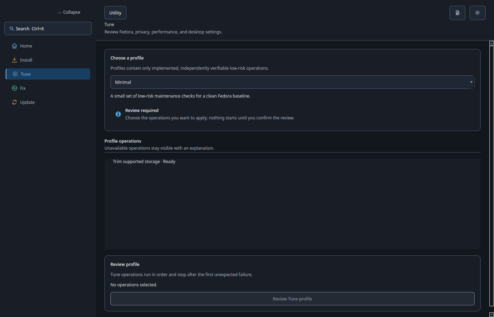
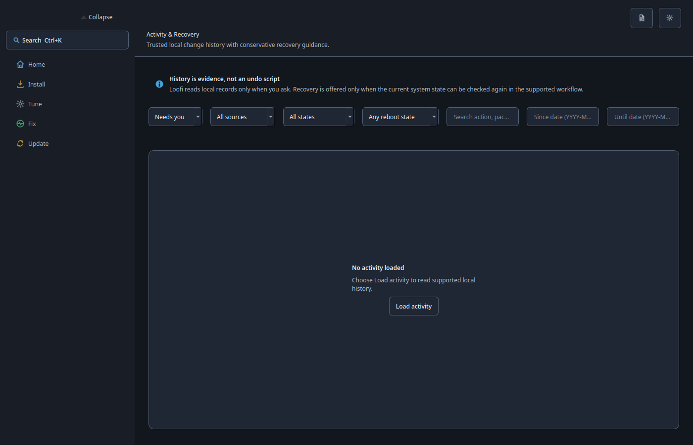

# GUI Reference — v29.0.1 "Utility"

The interface is organised around five jobs. Selecting a destination or search
result only navigates; execution begins from a reviewable task on its owning
page.

```text
Header: [Search] [Activity & Recovery] [Settings]
├── Home
├── Install
├── Tune
├── Fix
└── Update
```

## Home

Home displays the Fedora profile, compact status, one recommended next step,
shortcuts to the four jobs, and current activity.


## Install

Install provides a curated searchable app catalog with category filters,
installed state, source labels, and multi-select review. Flatpak is preferred
for ordinary GUI applications. Traditional Fedora may use RPM for trusted CLI
and system-integrated tools; Atomic RPM layering is advanced and reboot-aware.


## Tune

Tune starts from Minimal, Recommended, or Power User. The checked operations
remain editable. Profiles contain implemented, verifiable operations only and
exclude high-risk, boot, display, and manual-only changes.



## Fix

Fix begins with a symptom. Read-only diagnostics present findings before one
supported operation, instruction, or native-settings handoff is offered. There
is no **Fix all**.


## Update

System, Flatpak, and Firmware are separate cards with freshness, count,
details, and one primary action: **Check**, **Update**, **Continue**, or
**Verify**.


## Activity & Recovery

The secondary Activity surface groups **Needs you**, **In progress**, and
**History**. It owns reboot follow-up, explicit verification, and recovery
guidance for saved operations.



## Settings and accessibility

Settings is opened from the header. Goal-based search uses `Ctrl+K`, returns
focus to the selected task, and never executes from the result list. Layouts
respond to window width and scaling, while physical keyboard, theme, scaling,
and assistive-technology qualification is tracked separately.
