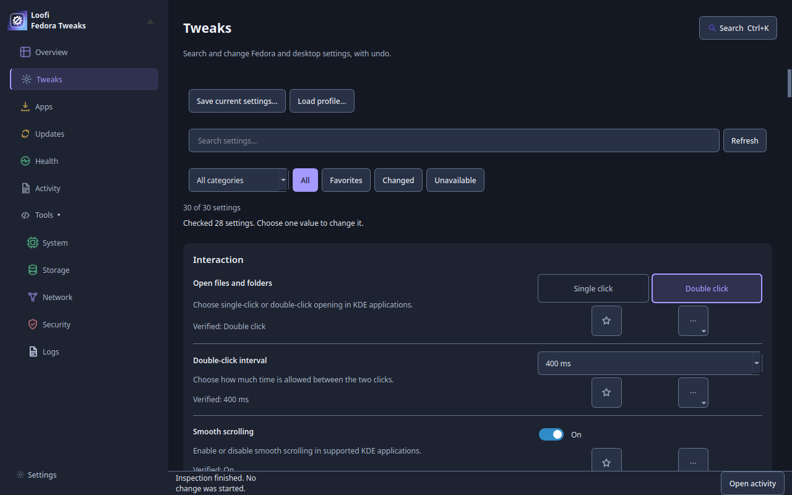
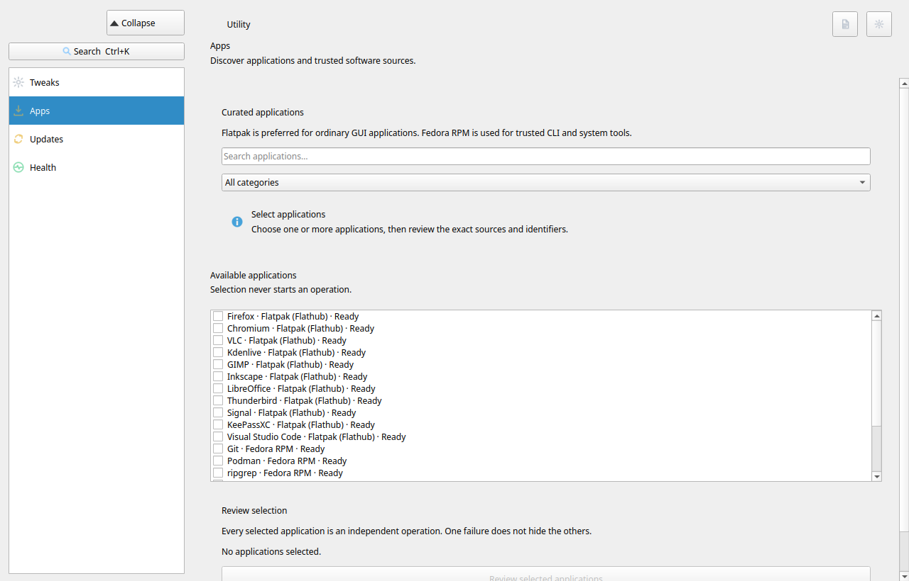
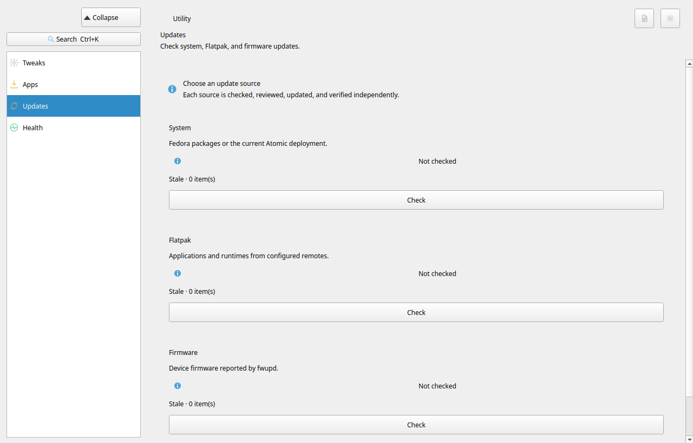
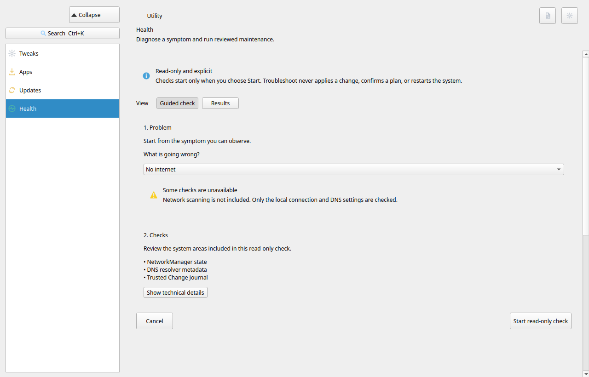
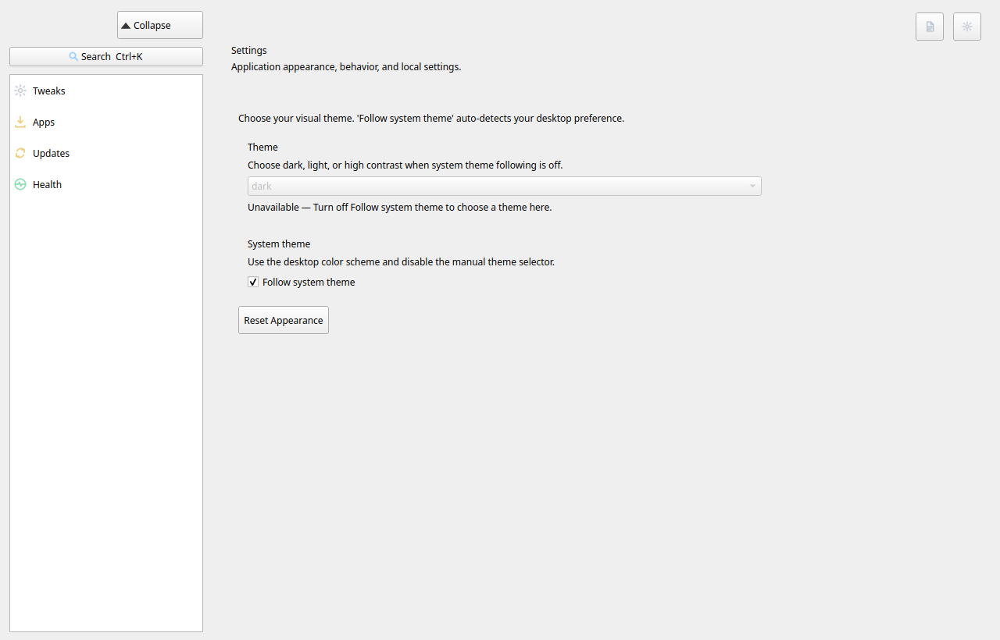

# GUI Reference — v32.2.0 "Coherence"

Loofi Fedora Tweaks opens on **Tweaks**. Four everyday jobs live in the sidebar;
selecting a destination or search result only navigates, and any change starts
from a reviewable task on its owning page.

```text
Sidebar: [Search Ctrl+K]
├── Tweaks   (start page)
├── Apps
├── Updates
└── Health
Header: [Activity & Recovery] [Settings]
```

Advanced pages (System, Storage, Network, Security, Logs) appear only after you
turn on **Show advanced tools** in Settings.

## Tweaks

Tweaks lists 73 controls across GNOME, KDE Plasma, and shared system settings,
grouped by theme (Appearance, Desktop, Interaction, Privacy, Input, Windows,
Sound, Power, System & Packaging). The full list with Loofi standard values is generated in
[docs/TWEAKS.md](https://github.com/loofiboss-bit/loofi-fedora-tweaks/blob/master/docs/TWEAKS.md).

- Each row shows the current value read from the system. Changes are checked
  before and after they run.
- **Use Loofi standard value** applies the catalog's curated reference value;
  it does not necessarily match the installed desktop's own default.
- **Restore previous value** is offered when verified history can safely
  recover the immediately preceding value.
- **Changed** filters settings that differ from Loofi's curated reference value.
- A fresh check blocks restoration when the setting has drifted since the
  verified change.
- Search matches titles and descriptions.



## Apps

A curated, searchable catalog with installed state and source labels. Flatpak is
preferred for GUI applications; RPM is used for trusted CLI and system tools.



## Updates

System, Flatpak and Firmware are separate cards with one primary action each:
**Check**, **Update**, **Continue** or **Verify**.



## Health

Health starts from a symptom and runs read-only diagnostics before offering one
supported operation or instruction. There is no **Fix all**.



## Settings and accessibility

Settings is opened from the header and holds the **Show advanced tools** switch.
Search uses `Ctrl+K` and never executes from the result list.


