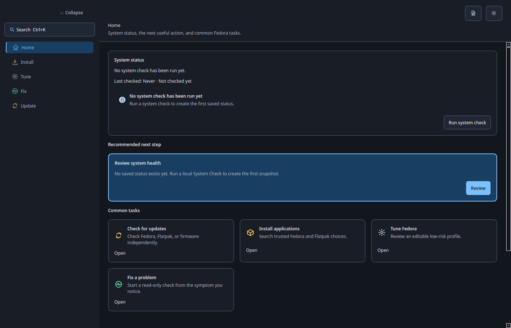
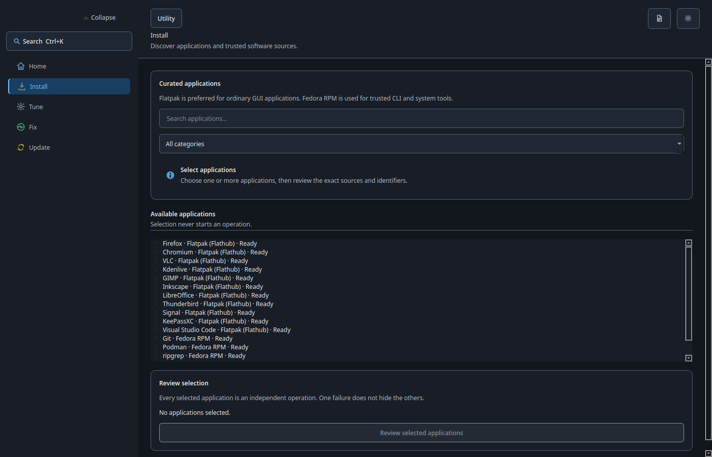
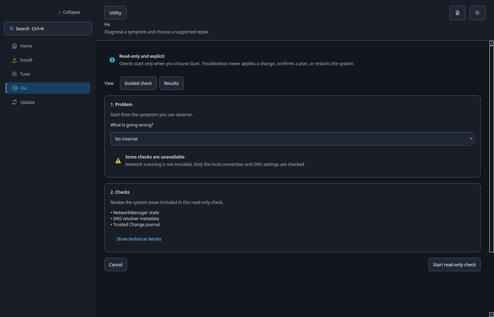
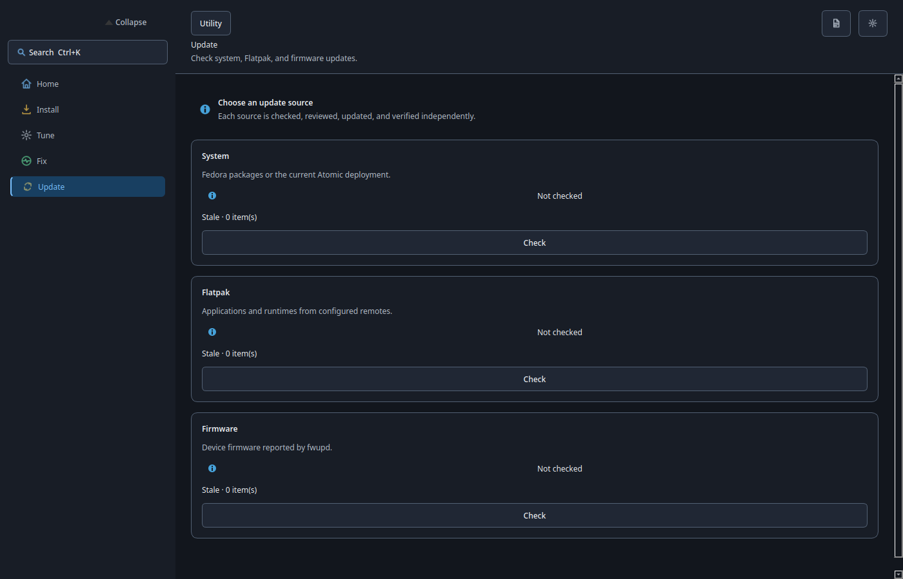
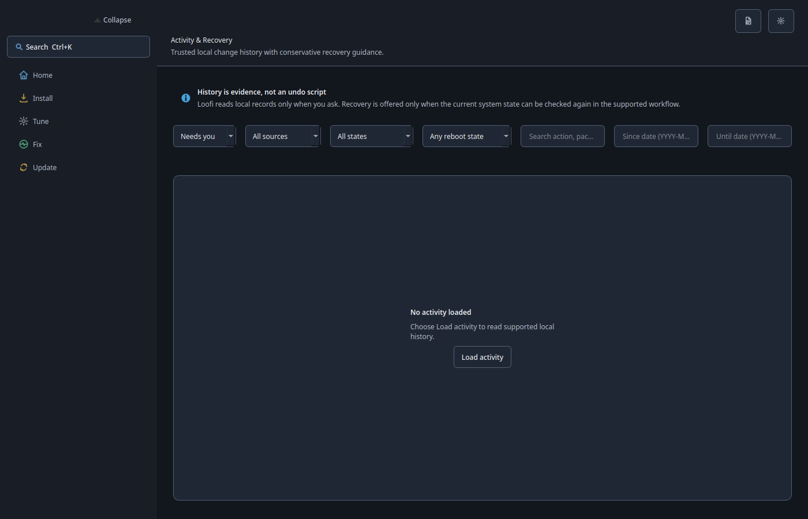

# GUI Reference — v30.2.0 "Comfort"

The interface is organised around five jobs. Selecting a destination or search
result only navigates; execution begins from a reviewable task on its owning
page.

```text
Header: [Search] [Activity & Recovery] [Settings]
├── Home
├── Apps
├── Tweaks
├── Health
└── Updates
```

## Home

Home displays the Fedora profile, compact status, one recommended next step,
shortcuts to the four jobs, and current activity.



## Apps

<a id="install"></a>

Apps provides a curated searchable app catalog with category filters,
installed state, source labels, and multi-select review. Flatpak is preferred
for ordinary GUI applications. Traditional Fedora may use RPM for trusted CLI
and system-integrated tools; Atomic RPM layering is advanced and reboot-aware.



## Tweaks

<a id="tune"></a>

Tweaks shows fourteen capability-scoped controls: seven on KDE and eight on
GNOME including shared power profiles. Current values, unavailable explanations,
and saved results stay on each row. KDE includes file opening, double-click
interval, smooth scrolling, and scrollbar behavior; GNOME includes clock format
and weekday display. Custom numeric values remain visible.

**Restore previous value** reviews the latest eligible verified change. Fresh
preflight blocks drift, later attempts, missing history, and removed choices.
A separately verified restore consumes its offer. KDE saved configuration may
require affected applications to reopen. There are no profiles or bulk restore.

The gallery captures predate Comfort; see [Screenshots](Screenshots).

## Health

<a id="fix"></a>

Health begins with a symptom. Read-only diagnostics present findings before one
supported operation, instruction, or native-settings handoff is offered. There
is no **Fix all**.



## Updates

<a id="update"></a>

System, Flatpak, and Firmware are separate cards with freshness, count,
details, and one primary action: **Check**, **Update**, **Continue**, or
**Verify**.



## Activity & Recovery

The secondary Activity surface groups **Needs you**, **In progress**, and
**History**. It owns reboot follow-up, explicit verification, and recovery
guidance for saved operations.



## Settings and accessibility

Settings is opened from the header. Goal-based search uses `Ctrl+K`, returns
focus to the selected task, and never executes from the result list. Layouts
respond to window width and scaling, while physical keyboard, theme, scaling,
and assistive-technology qualification is tracked separately.
