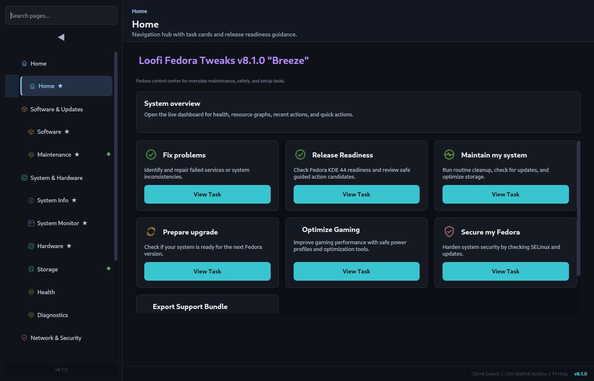
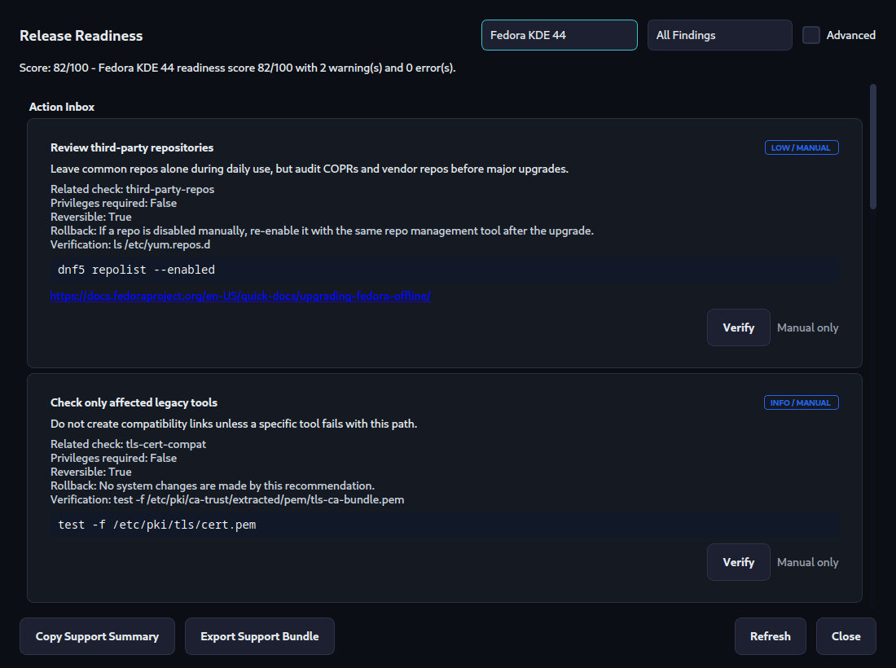
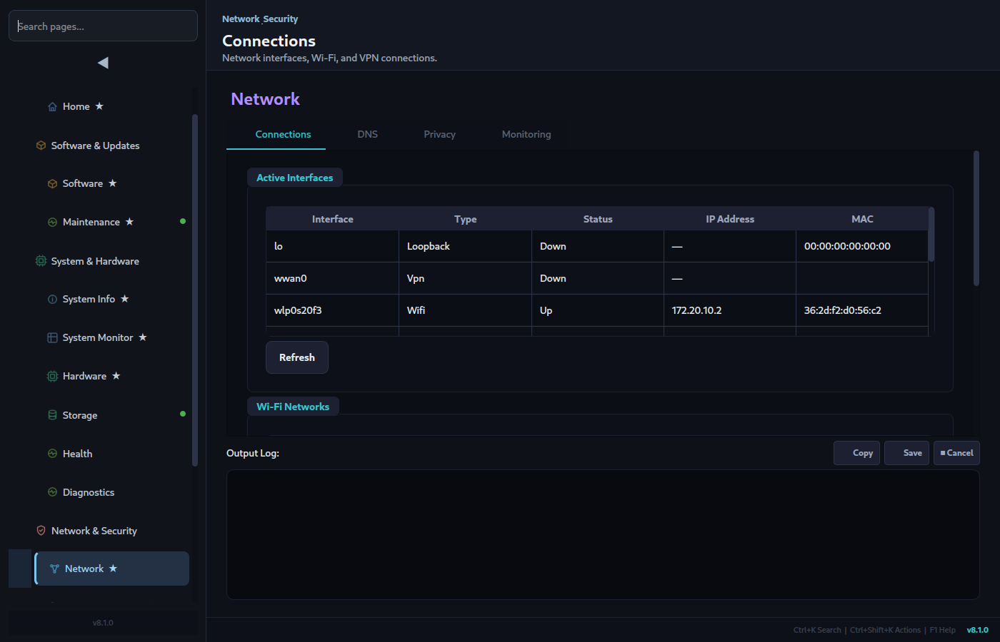
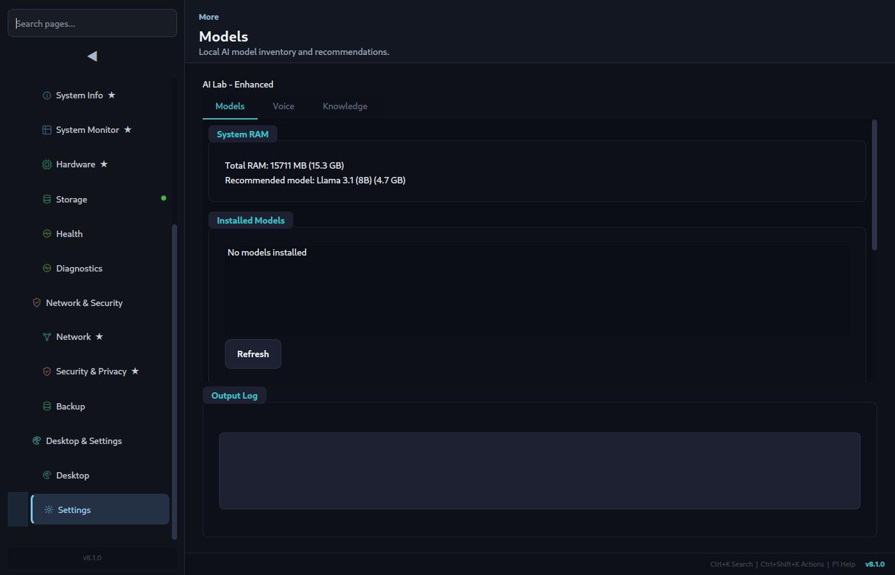
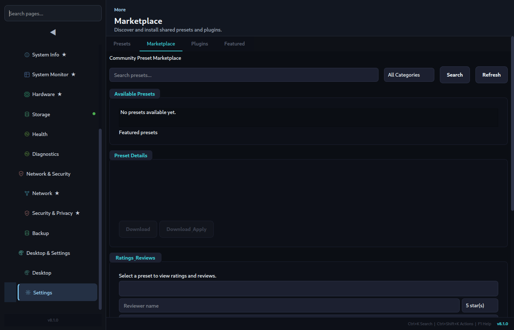

# Loofi Fedora Tweaks Wiki

Welcome to the official wiki for **Loofi Fedora Tweaks** — a modern Fedora control center for maintenance, diagnostics, security, performance, and automation.

**Current Version**: v8.1.0 "Breeze" — Focused Fedora Control Center
**Screenshots Refreshed**: May 2026

## At a Glance

- **Focused navigation**: v8.1 uses five default areas for everyday Fedora workflows while preserving stable route IDs for search, favorites, quick actions, breadcrumbs, and dashboard cards.
- **Task-based Home**: Home cards route users into focused maintenance, readiness, and safety workflows.
- **Advanced tools on demand**: AI Lab, Agents, Automation, Logs, Community, Teleport, Virtualization, Gaming, Performance, Profiles, Extensions, Snapshots, and Loofi Link remain searchable and favoriteable without crowding the sidebar.
- **Safe actions**: Privileged operations use `pkexec`; command preview and execution share the same allowlist checks.
- **First-Class Atomic Support**: Dedicated `rpm-ostree` diagnostics and upgrade checks for Silverblue/Kinoite.
- 4 run modes: GUI, CLI (`--json`), daemon scheduler, and Web API.
- Privileged actions through `pkexec` (never `sudo`).

## Start Here

- [Installation](Installation)
- [Getting Started](Getting-Started)
- [GUI Tabs Reference](GUI-Tabs-Reference)
- [CLI Reference](CLI-Reference)
- [Screenshots](Screenshots)

## Feature Preview

### Core Workflows

| System Monitor | Maintenance Updates |
| --- | --- |
|  |  |

| Release Readiness | Security and Privacy |
| --- | --- |
|  |  |

### Advanced Workflows

| Network Connections | Settings Appearance |
| --- | --- |
|  |  |

| AI Lab Models | Community Marketplace |
| --- | --- |
|  |  |

## Wiki Pages

### Getting Started

- [Installation](Installation)
- [Getting Started](Getting-Started)
- [FAQ](FAQ)

### Features and Usage

- [GUI Tabs Reference](GUI-Tabs-Reference)
- [CLI Reference](CLI-Reference)
- [Configuration](Configuration)
- [Screenshots](Screenshots)

### Architecture and Development

- [Architecture](Architecture)
- [Plugin Development](Plugin-Development)
- [Security Model](Security-Model)
- [Atomic Fedora Support](Atomic-Fedora-Support)

### Contributing and Support

- [Contributing](Contributing)
- [Testing](Testing)
- [CI/CD Pipeline](CI-CD-Pipeline)
- [Troubleshooting](Troubleshooting)

### Reference

- [Changelog](Changelog)

## Quick Links

- GitHub Repository: [loofiboss-bit/loofi-fedora-tweaks](https://github.com/loofiboss-bit/loofi-fedora-tweaks)
- Latest Release: [v8.1.0](https://github.com/loofiboss-bit/loofi-fedora-tweaks/releases/tag/v8.1.0)
- Issues: [Issue Tracker](https://github.com/loofiboss-bit/loofi-fedora-tweaks/issues)
- Main README: [README.md](https://github.com/loofiboss-bit/loofi-fedora-tweaks/blob/master/README.md)
- Architecture Doc: [ARCHITECTURE.md](https://github.com/loofiboss-bit/loofi-fedora-tweaks/blob/master/ARCHITECTURE.md)

## Support

1. Check [Troubleshooting](Troubleshooting).
2. Search existing [GitHub Issues](https://github.com/loofiboss-bit/loofi-fedora-tweaks/issues).
3. Run `loofi-fedora-tweaks --cli doctor` and `loofi-fedora-tweaks --cli support-bundle`.
4. Open a new issue with Fedora version, desktop environment, repro steps, and logs.
