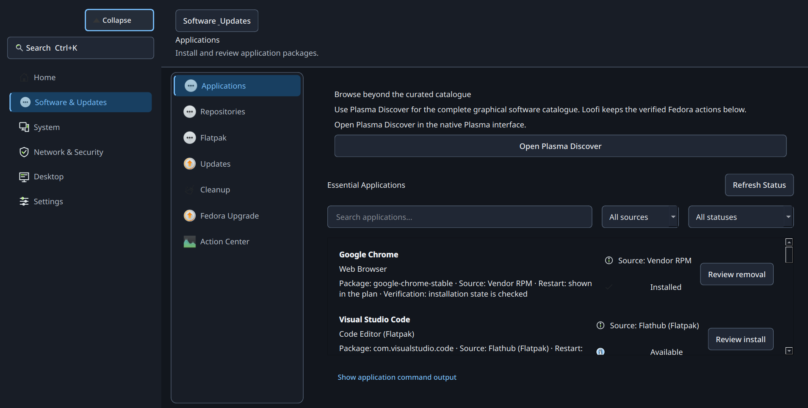
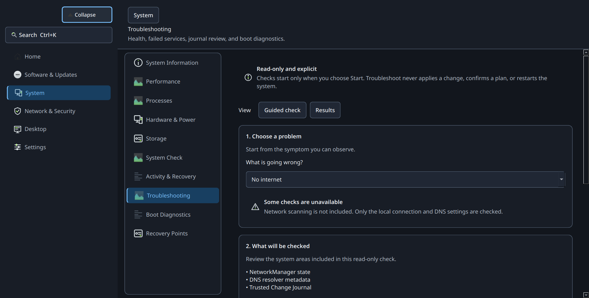
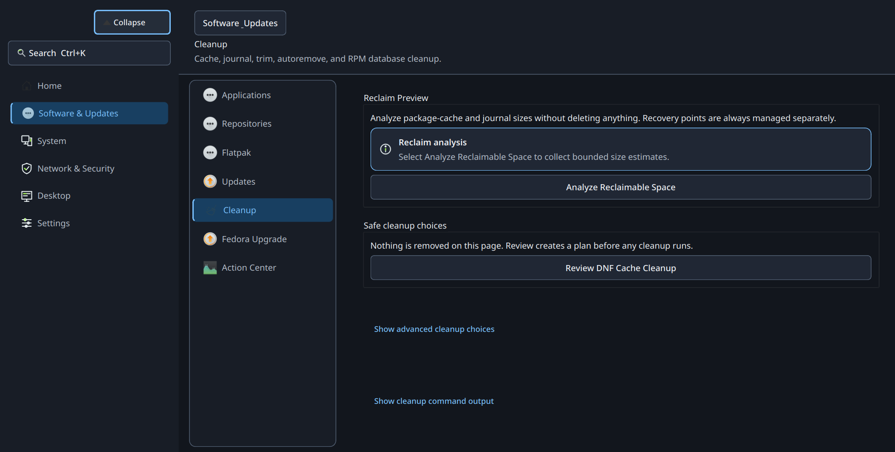
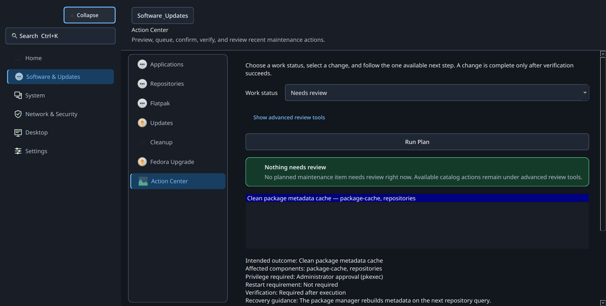

# Visual Interface Gallery — v28.0.2 "Ease"

> Documented for the v28.0.2 "Ease" public release.

This gallery showcases the primary destinations, dialogs, and verification surfaces of Loofi Fedora Tweaks. The interface is desktop-neutral, supporting dark and light themes, high-DPI scaling, and responsive window sizing across GNOME, KDE Plasma, XFCE, and tiling Wayland environments.

---

## 1. Home Dashboard

The initial launch screen presenting system status, environment detection (desktop, display server, kernel, architecture), the single prioritized recommendation, and quick maintenance shortcuts.

---

## 2. Updates & Multi-Source Maintenance

The multi-stream update inspection screen showing independent status for system packages (DNF5 / rpm-ostree), Flatpak applications, and hardware firmware via `fwupd`.

### Native Application Center Handoff
When discovering new applications, Loofi hands off the request to the desktop's native center (GNOME Software or KDE Discover) using AppStream identifiers.

---

## 3. System Health & Diagnostics

### Symptom-Driven Troubleshooting
Selecting an issue symptom runs bounded, read-only diagnostic checks and outputs an actionable finding with an optional reviewed remedy.

### Storage & Safe Reclaim Preview
Audits disk space across mount points and previews reclaimable bytes from package caches, thumbnail stores, and vacuumed systemd journals.

### Hardware & Resource Telemetry
Live telemetry for CPU, RAM, compressed ZRAM swap, disk I/O, and laptop battery health / charging threshold limits.

---

## 4. Protection & Recovery

### Security & Firewall Audit
Audits active `firewalld` zones, listening network ports, and service exposure.

### Rollback & Recovery Points
Inspects Btrfs snapshots and Atomic deployment rollback points before reviewing a recovery plan.

---

## 5. Changes (The Action Center)

The single authority for reviewing, authorizing (`pkexec`), executing, and independently verifying persistent system changes.

---

## 6. Settings & Doctor Diagnostics

### Appearance & Navigation Preferences
Configure application themes (Dark, Light, System), navigation styles, and custom text scaling.

### State Doctor
Read-only self-test inspecting dependencies, environment health, and Polkit authorization readiness.

