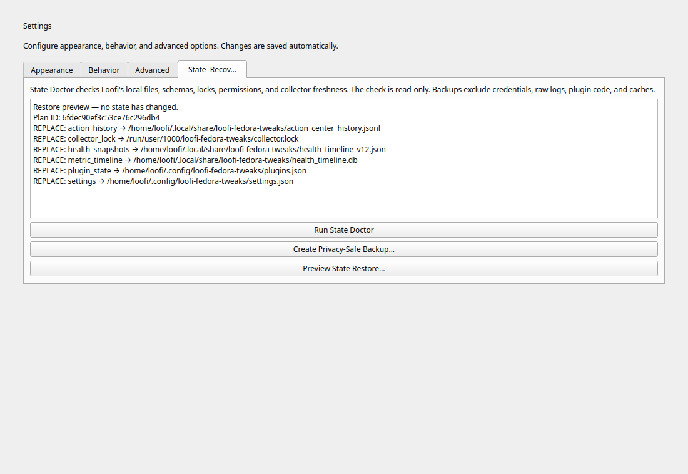
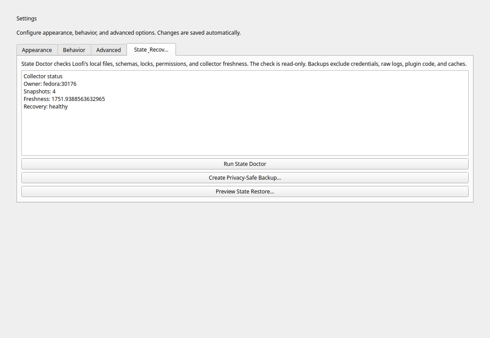
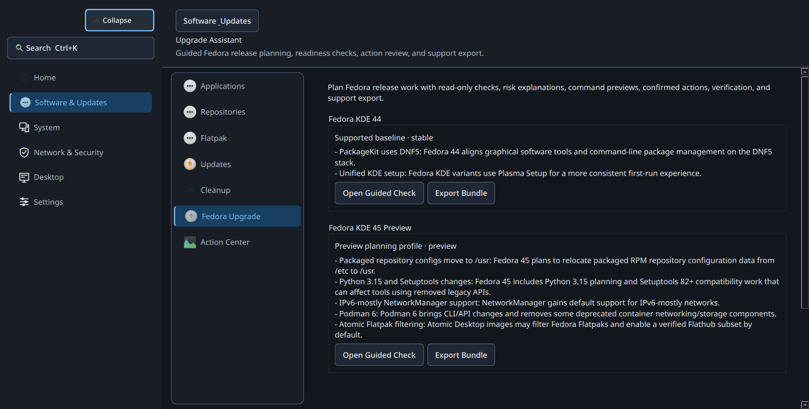
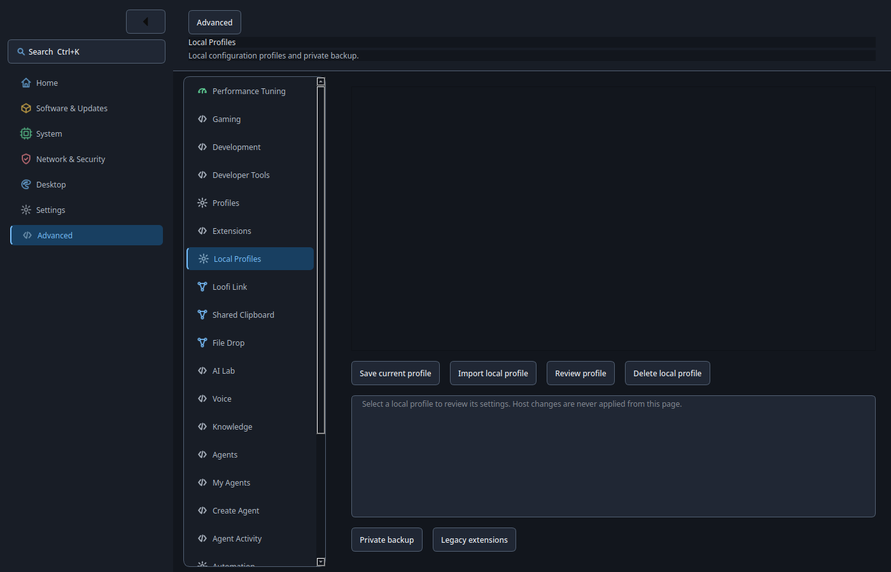
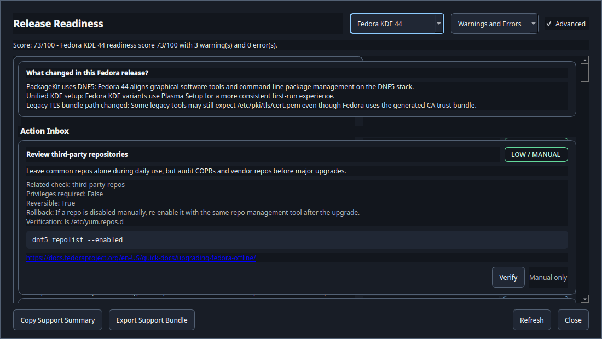

# Screenshots

UI screenshots for the exact **v18.0.0 "Haven"** candidate, captured from the
real PyQt application on 2026-07-22. The capture script also synchronized these
wiki assets from the user-guide catalog.

## State & Recovery

| State Doctor | Restore Preview | Collector Status |
| --- | --- | --- |
|  |  |  |

## Navigation and System Workflows

| Home Dashboard | System Monitor |
| --- | --- |
|  |  |

| Maintenance Updates | Release Readiness |
| --- | --- |
|  |  |

## Upgrade Planning

## Network and Security

| Network Connections | Security and Privacy |
| --- | --- |
|  |  |

## Personalization and Tools

| Settings Appearance | AI Lab Models |
| --- | --- |
|  |  |

## Local Profiles and Legacy Extensions

## Advanced Readiness

