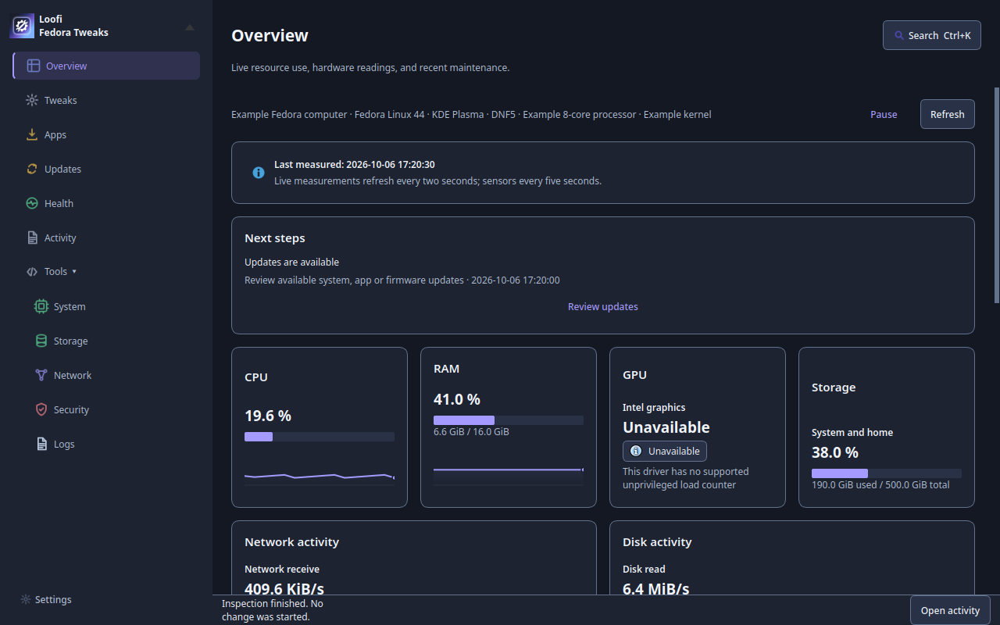
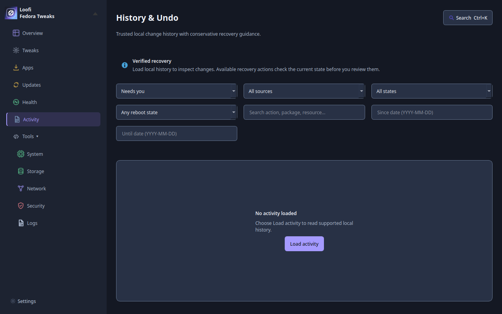
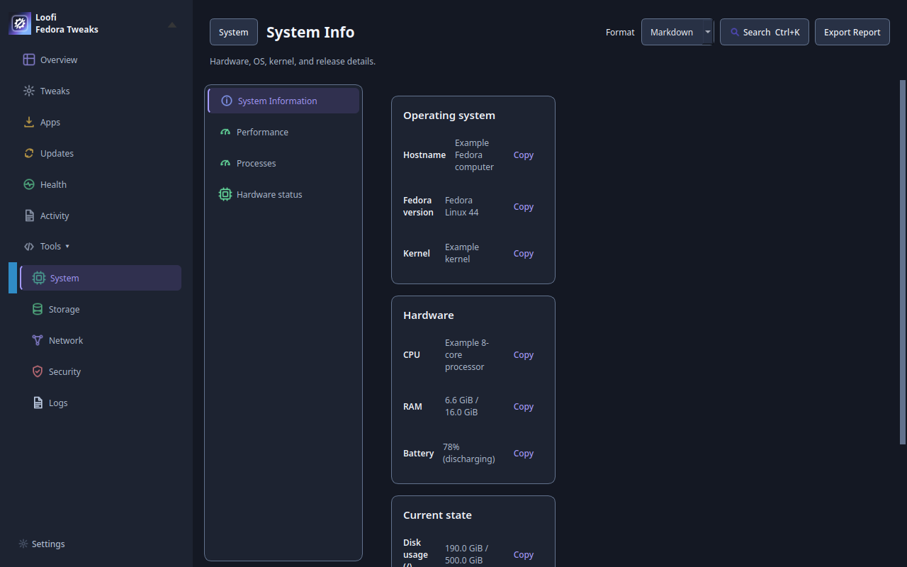

# Control Center Interface Gallery

Local redesign candidate using deterministic offscreen example data. These
captures show the actual PyQt interface; they do not qualify a physical KDE or
GNOME session or assistive technology. No release or installation is implied.

Regenerate with `scripts/capture_control_center_screenshots.py`.

## Overview

## Tweaks

## Apps

## Updates

## Health

## Activity

## Settings

## Tools: System

