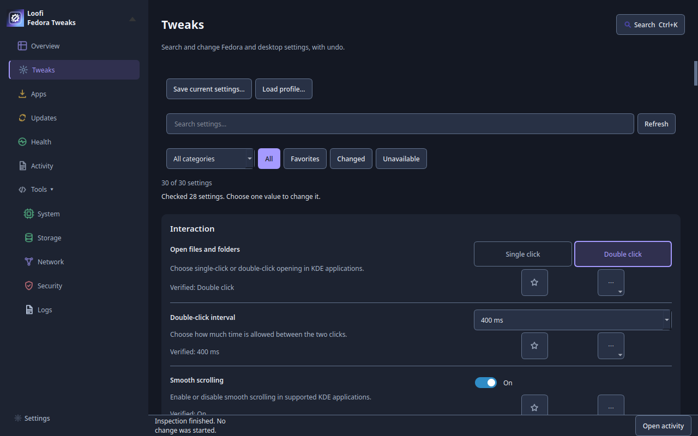
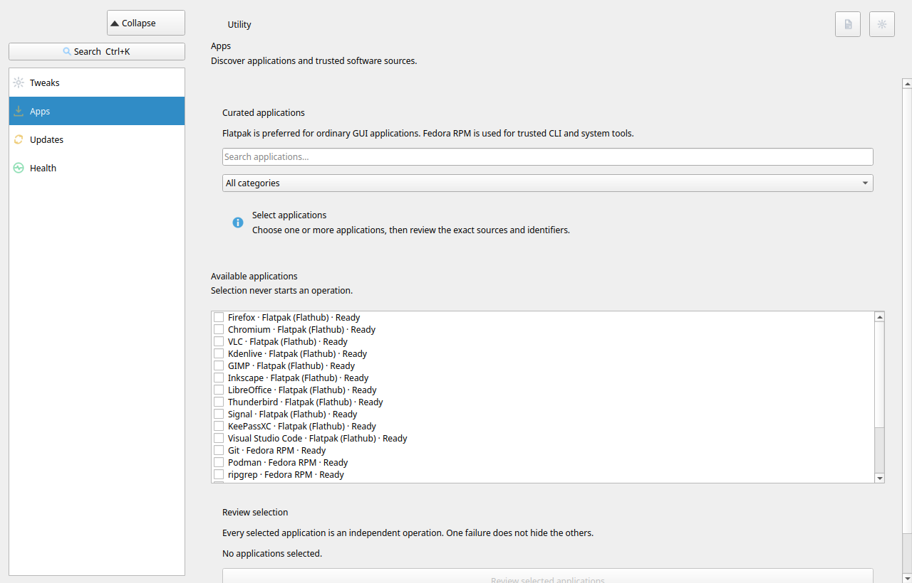
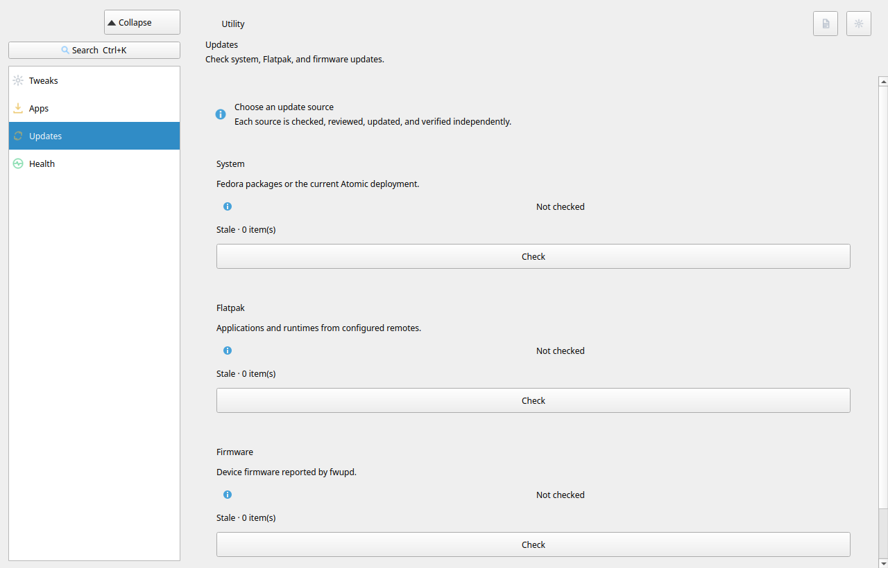
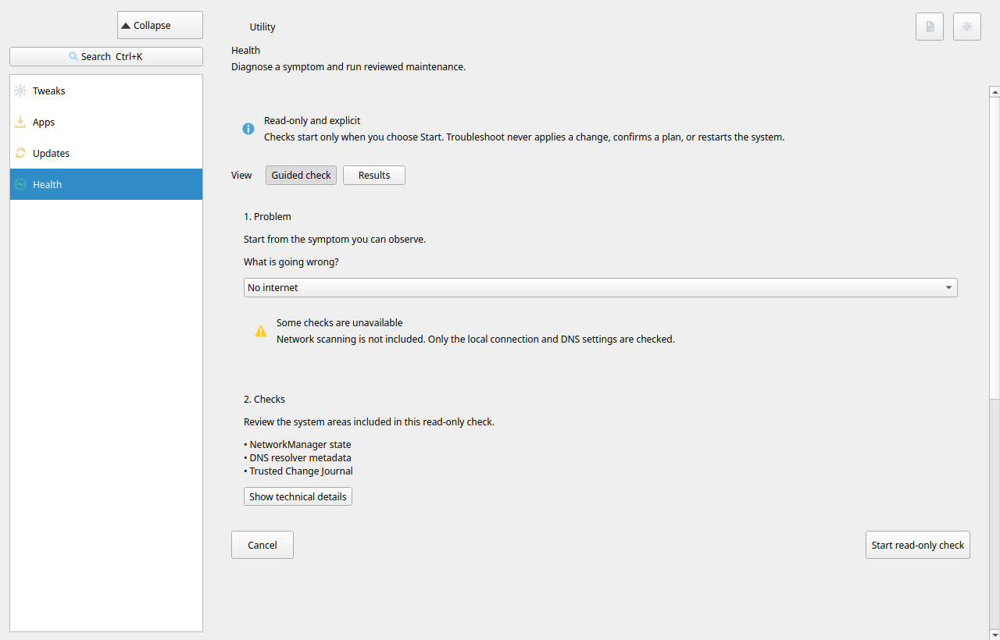
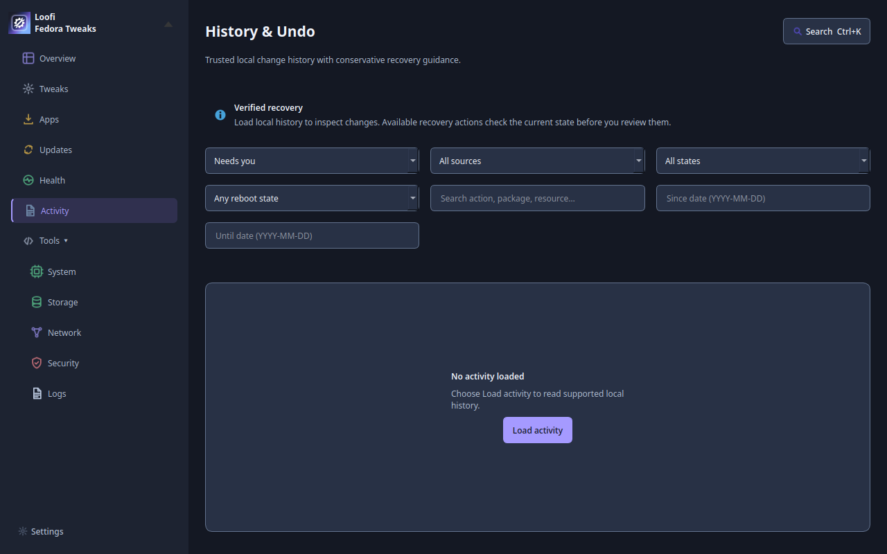
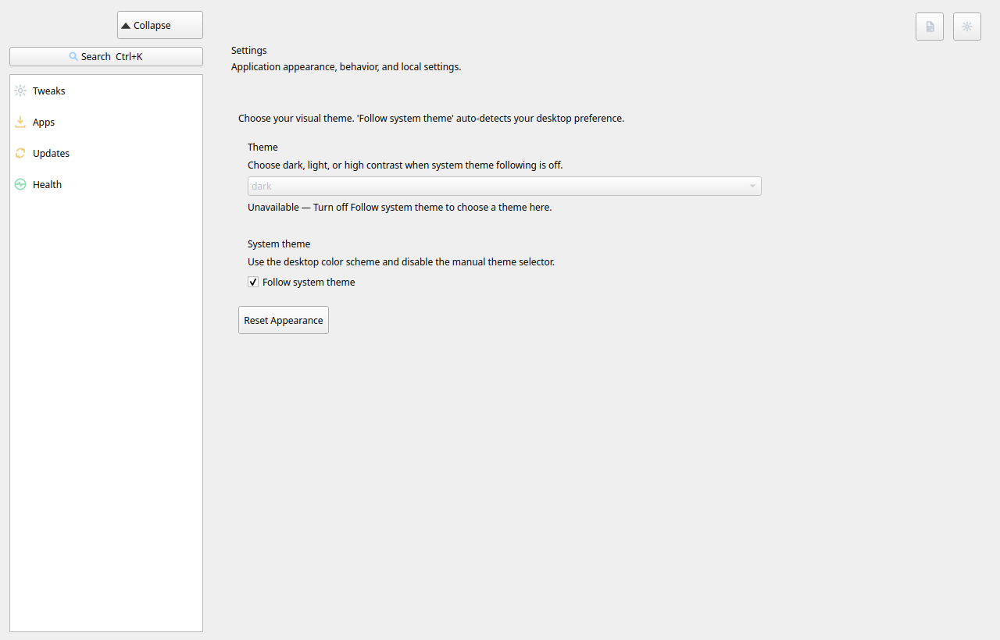
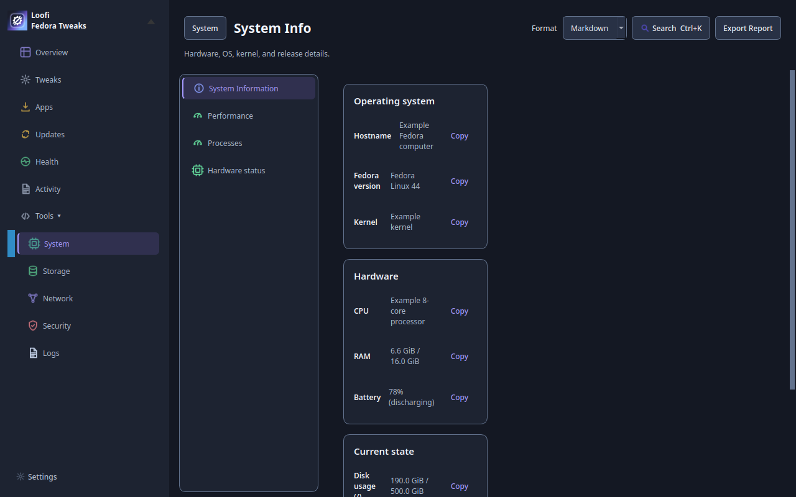

# Control Center Interface Gallery

Repository-owned screenshots captured during earlier qualification using deterministic offscreen example data. These
captures show the actual PyQt interface; they do not qualify a physical KDE or
GNOME session or assistive technology. These historical captures are illustrative; they are not an exact v33.0.1 visual qualification. See the release qualification report for current evidence limits.

Regenerate with `scripts/capture_control_center_screenshots.py`.

## Overview

## Tweaks

## Apps

## Updates

## Health

## Activity

## Settings

## Tools: System

